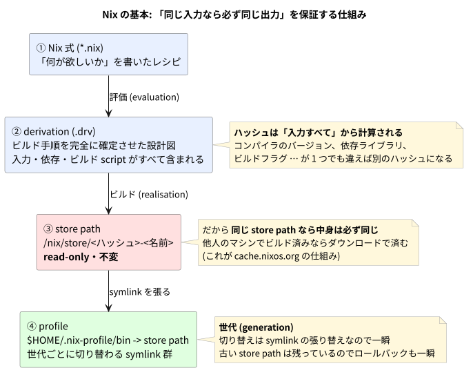

# 01. Nix の基礎

Nix は「パッケージマネージャ」と紹介されることが多いが、apt や brew とは根本的に発想が違う。ここを掴むと以降がすべて楽になる。

## 一言でいうと

> **同じ入力からは必ず同じ出力が得られる**ことを、ハッシュによって保証する仕組み。

apt や brew は「システムに 1 つだけ入っている `/usr/bin/git`」を書き換えていく。だから「昨日は動いていたのに」が起きる。

Nix は違う。すべてのビルド結果を `/nix/store/<ハッシュ>-<名前>` という**内容で決まる場所**に置き、そこは二度と書き換えない。



## 4 つの登場人物

### ① Nix 式 (`*.nix`)

「何が欲しいか」を書いたレシピ。Nix 言語という専用の言語で書く。

```nix
{ pkgs, ... }:
{
  home.packages = with pkgs; [ bat eza ripgrep ];
}
```

<details><summary>Nix 言語について</summary>

関数型の設定記述言語。慣れるまで独特だが、実際に書くのは次の 3 つがほとんど。

- **attribute set (attrset)** — `{ a = 1; b = 2; }`。JSON のオブジェクトに相当する。**末尾のセミコロンが必須**なのが最大のハマりどころ
- **リスト** — `[ 1 2 3 ]`。**カンマで区切らない**
- **関数** — `{ pkgs, ... }: { ... }`。`:` の左が引数、右が戻り値。`...` は「他の引数が来ても無視する」の意味

`with pkgs; [ bat eza ]` は「`pkgs.` を省略して書く」という糖衣構文。`[ pkgs.bat pkgs.eza ]` と同じ。

</details>

### ② derivation (`.drv`)

Nix 式を評価すると derivation ができる。これは**ビルド手順を完全に確定させた設計図**で、入力・依存・ビルドスクリプトがすべて含まれている。

<details><summary>derivation (デリベーション) とは</summary>

「このソースを、このコンパイラで、このフラグでビルドせよ」を過不足なく記述したもの。人間が読むものではないが、**Nix の再現性の核**。

重要なのは、この内容から**ハッシュが計算される**こと。コンパイラのバージョンが上がれば derivation が変わり、ハッシュも変わる。

</details>

### ③ store path (`/nix/store/...`)

derivation をビルドすると `/nix/store/q6yfdws28aj...-nix-2.35.1` のようなパスができる。

- 先頭のハッシュは**入力すべて**から計算される
- **read-only**。ビルド後は誰も書き換えられない
- したがって **同じ store path なら中身は必ず同じ**

これが決定的に効く。他人のマシンで同じ store path をビルド済みなら、**ビルドせずダウンロードするだけでよい**。これが `cache.nixos.org` の仕組み。

<details><summary>なぜ read-only であることが重要なのか</summary>

書き換えられないので、「いつのまにか壊れていた」が原理的に起こらない。

副作用として、**実行時に自分の設定ファイルを書き換えるツールは store に置けない**。この移行では `~/.config/mise/config.toml` (mise が `sed -i` する) や `~/.config/git/config` (`git config --global` が書く) がこれに該当し、例外扱いにしている。

</details>

### ④ profile

store path は `/nix/store/...` という人間に優しくない場所にある。そこで `~/.nix-profile/bin/bat` → `/nix/store/xxx-bat-0.25.0/bin/bat` という symlink を張る。この symlink の集合が profile。

`~/.nix-profile/bin` に PATH を通せば、普通に `bat` と打てるようになる。

<details><summary>世代 (generation) とは</summary>

profile を更新すると、古い symlink 集合は消されず**世代として残る**。

```
generation 1 -> bat 0.24 / eza 0.20
generation 2 -> bat 0.25 / eza 0.21   <- 現在
```

切り替えは symlink を張り替えるだけなので一瞬。古い store path も残っているので、**ロールバックも一瞬**。これが Nix 最大の実用的な利点。

</details>

## flake とは

ここまでの仕組みに「依存の固定」と「決まった入口」を足したもの。

```nix
{
  inputs = {
    nixpkgs.url = "github:NixOS/nixpkgs/nixpkgs-unstable";
    home-manager.url = "github:nix-community/home-manager";
  };
  outputs = { self, nixpkgs, home-manager, ... }: { /* ... */ };
}
```

- **`inputs`** — 何に依存するか
- **`outputs`** — 何を提供するか

<details><summary>flake (フレーク) とは</summary>

Nix プロジェクトの標準的なパッケージング形式。`flake.nix` が入口になる。

重要なのは、`flake.nix` と対になる **`flake.lock`** が自動生成されること。ここに依存の**正確なコミットハッシュ**が記録される。

```json
"nixpkgs": {
  "locked": {
    "rev": "70ce234312134a463ba7728e94da2486a1d237ac",
    "narHash": "sha256-X44cn5rzytELc3NNoQsh0aLkjWA/QzPfc6HPQmsG3sU="
  }
}
```

これがあるので、**半年後に別のマシンで実行しても同じバージョンが入る**。このリポジトリが日次 pin の自作ロジックを捨てられるのはこのため。

</details>

<details><summary>nixpkgs とは</summary>

Nix の巨大なパッケージコレクション。10 万を超えるパッケージの Nix 式が入った GitHub リポジトリ。

`pkgs.bat` と書けるのは、nixpkgs が `bat` の定義を持っているから。「あのツールは Nix にあるか?」は <https://search.nixos.org/packages> で調べられる。

</details>

<details><summary>narHash とは</summary>

ファイルツリー全体のハッシュ。`nar` は Nix ARchive の略で、Nix 独自のアーカイブ形式。

`flake.lock` にリビジョンと一緒に記録され、「取得した中身がすり替わっていないか」の検証に使われる。

</details>

## 実際に触ってみる

```sh
# Nix をインストール
curl -fsSL https://install.determinate.systems/nix | sh -s -- install

# インストールせずに一度だけ実行する
nix run nixpkgs#cowsay -- hello

# 一時的にシェルへツールを入れる (抜けると消える)
nix shell nixpkgs#ripgrep
```

`nix run` は「ダウンロードして実行して終わり」。システムに何も残らない。この気軽さも Nix の特徴。

---

前: [00_introduction.md](./00_introduction.md) / 次: [02_home_manager.md](./02_home_manager.md)
