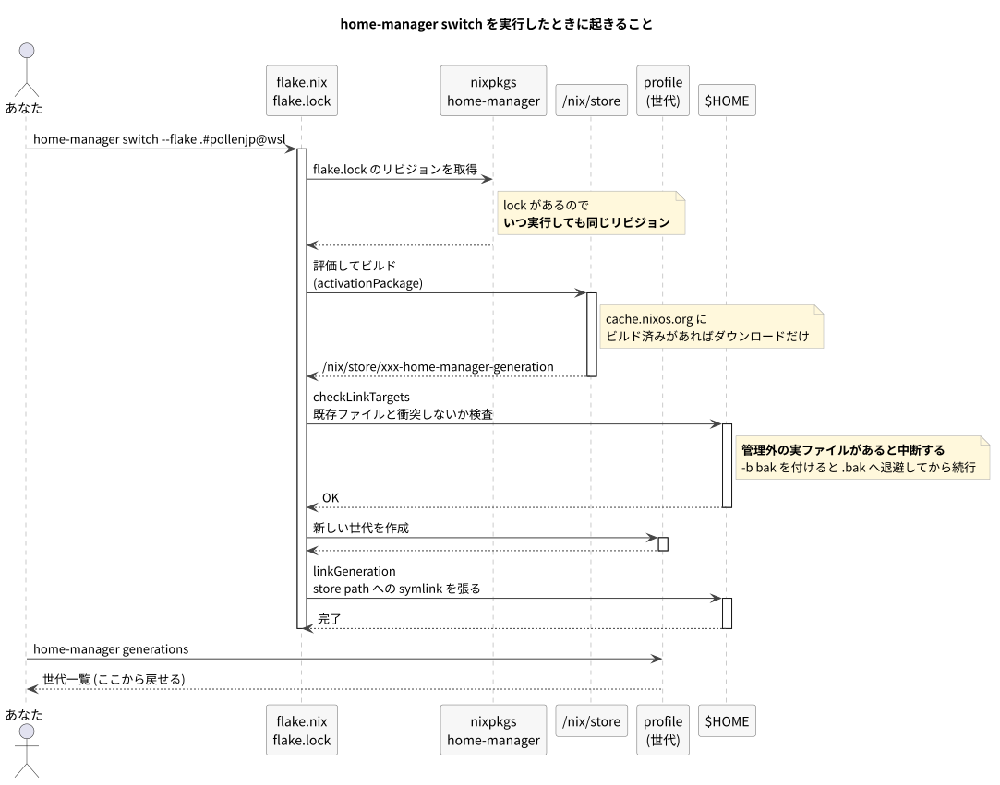

# 02. home-manager とは

Nix は「パッケージを再現性よく用意する」仕組みだった。home-manager は、そこに **「ホームディレクトリの中身を宣言的に管理する」** 層を足す。

## 何をしてくれるのか

1. **パッケージを入れる** — `home.packages` に書いたツールが `~/.nix-profile/bin` に入る
2. **設定ファイルを配置する** — `home.file` / `xdg.configFile` に書いたファイルが `$HOME` に symlink される
3. **アプリの設定を生成する** — `programs.git` のように、Nix の記述から設定ファイルを**生成**する

そして 1〜3 すべてがまとめて **1 つの世代**になる。だからロールバックが効く。

## switch したときに何が起きるか



<details><summary>activationPackage とは</summary>

home-manager がビルドする「この世代の完成形」。中身は次のようなもの。

- `home-files/` — `$HOME` に配置されるファイルツリーそのもの
- `activate` — 実際に symlink を張るシェルスクリプト

**`activate` を実行する前に `home-files/` を覗ける**のが重要。「適用したら何が置かれるか」を `$HOME` に触れずに完全に確認できる。

```sh
nix build '.#homeConfigurations."pollenjp@wsl".activationPackage' -o /tmp/hm
find /tmp/hm/home-files
```

</details>

<details><summary>checkLinkTargets とは</summary>

activation の最初に走る安全装置。「これから管理しようとしているパスに、home-manager が作ったのではない実ファイルが既にないか」を検査する。

見つかると次のエラーで**中断する**（何も壊さずに止まる）。

```
Existing file '/home/user/.tmux.conf' would be clobbered by home-manager
```

`main.bash setup` が張った symlink もこれに引っかかる。だから移行時は先に外す必要がある。

`-b bak` を付けると、中断せずに `.bak` へ退避してから続行する。ただし **`.bak` が既にあると失敗する**ので、リトライ時は古い `.bak` を消しておくこと。

</details>

## 3 つの書き方

同じ `~/.gitconfig` を管理するにも、書き方が 3 通りある。使い分けが大事。

### A. ファイルをそのまま置く

```nix
xdg.configFile."starship.toml".source = ../files/starship.toml;
```

既存の設定ファイルを**そのまま**配置する。書き換えコストがゼロ。今回の移行では starship / zellij / nvim / tmux などがこれ。

### B. ネイティブモジュールを使う

```nix
programs.git = {
  enable = true;
  userName = "pollenjp";
  delta.enable = true;
};
```

Nix の記述から設定ファイルを**生成**する。OS 分岐や条件付き設定が書けるのが利点。

```nix
# WSL のときだけ 1Password のパスを設定する
programs.git.extraConfig = lib.mkIf config.dotfiles.wsl.enable {
  "gpg \"ssh\"".program = "/mnt/c/Users/.../op-ssh-sign-wsl.exe";
};
```

今の `.gitconfig` はこのパスを**手でコメント切り替え**している。それが消えるのがこの方式の価値。

<details><summary>lib.mkIf とは</summary>

「条件が真のときだけこの設定を有効にする」。

普通の Nix の `if` と違い、**条件が偽のときは「設定していない」扱い**になる。他のモジュールが同じオプションを設定していても衝突しない。home-manager のモジュールシステムと噛み合う書き方。

</details>

### C. 使わない (あえて素のファイル)

ネイティブモジュールがあっても使わない方がよい場合がある。今回そう判断したもの:

| ツール | 使わない理由 |
| --- | --- |
| `programs.tmux` | 独自の prefix / escape-time 設定を勝手に前置する。tpm を使っていないので利点がない |
| `programs.neovim` | `init.lua` を書き出すため、`~/.config/nvim` のディレクトリ配置と衝突する |
| `programs.zellij` | 552 行の KDL を Nix に書き換えるコストが高い。加えて `enable*Integration` は**シェル起動のたびに zellij を自動起動する**罠がある |

「ネイティブモジュールがあるから使う」ではなく、**書き換えコストと得られる利点を比べて決める**。

## store 管理と直接編集の違い

home-manager には 2 つの方針がある。

| | store 管理 (今回採用) | `mkOutOfStoreSymlink` |
| --- | --- | --- |
| 実体の場所 | `/nix/store/...` | `~/dotfiles/...` |
| 編集後 | `home-manager switch` が必要 | **即座に反映** |
| ロールバック | 中身まで完全に戻る | 張り直すだけ。中身は戻らない |
| 再現性 | 高い | 低い |

今回は**再現性を優先して store 管理**を選んだ。編集のたびに `switch` が要るのは手間だが、「あるマシンだけ設定が違う」が起きなくなる。

<details><summary>なぜ store 管理だと switch が必要なのか</summary>

store 管理では、リポジトリのファイルは**ビルド時に `/nix/store` へコピー**される。`$HOME` の symlink はそのコピーを指す。

だからリポジトリ側を編集しても、store の中身は古いまま。新しくビルドして symlink を張り替える (= `switch`) 必要がある。

逆に言えば、**`$HOME` の状態は常にどれかの世代と正確に一致している**。これが再現性の根拠。

</details>

## 例外: store に置けないファイル

store は read-only なので、**実行時にツール自身が書き込むファイルは置けない**。調査で見つかったものは次のとおり。

| パス | 誰が書くか | どうするか |
| --- | --- | --- |
| `~/.config/mise/config.toml` | mise (`sed -i` / `mise use --pin`) | Nix 管理下に置かず mise に任せる |
| `~/.config/git/config` | `git config --global` | `includes` で `config.local` に書込先を逃がす |
| `~/.config/fish/fish_plugins` | fisher | Stage 5 で fisher ごと不要にする |
| `~/.common_shellrc.sh` | あなた自身 | **絶対に管理下に置かない** (復旧経路) |

移行を設計するときは、まず「**このファイルは実行時に誰かが書くか?**」を確認する。これを見落とすと、動いていたツールが突然「Permission denied」で壊れる。

---

前: [01_nix_basics.md](./01_nix_basics.md) / 次: [03_this_repo.md](./03_this_repo.md)
