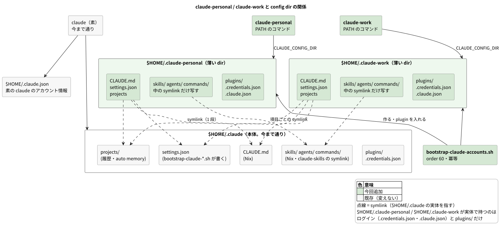

# ADR: Claude Code のログインアカウントを personal / work で分けるため、ログインだけを持つ config dir を全マシンに置く

| 項目 | 内容 |
| --- | --- |
| ステータス | 提案 (Proposed) — レビュー中 |
| 日付 | 2026-09-27 (JST) |
| 決定者 | pollenjp |
| チケット | [TKT-34](https://app.notion.com/p/claude-personal-claude-work-CLAUDE_CONFIG_DIR-Claude-Code-3e879149a66f8192b2d3d5b479c1de0b) |
| 前提 ADR | [007_claude_skill_host_option](../007_claude_skill_host_option_20260926T130250JST/README.md)（Claude Code が書き換えるファイルへは「Nix が値を置き、bootstrap が写す」） |
| 運用手順 | [`nix/README.md`「Claude Code のアカウントを分ける」](../../../nix/README.md#claude-code-のアカウントを分ける-claude-personal--claude-work) |

---

## 1. 背景 (Context)

### やりたかったこと

個人のアカウントと会社のアカウントで、Claude Code のログインを分けて使いたい。
**分けたいのはログインだけ**で、CLAUDE.md・skill・フック・設定・履歴と memory は
どちらで起動しても同じものを使いたい。素の `claude` の使い方は変えず、アカウントを
明示したいときだけ `claude-personal` / `claude-work` で起動する。

出発点は次の関数だった (zsh / bash 用)。

```sh
claude-personal() {
  env -u ANTHROPIC_API_KEY \
    CLAUDE_CONFIG_DIR="$HOME/.claude-personal" \
    command claude "$@"
}
```

### `CLAUDE_CONFIG_DIR` はログイン以外もまとめて動かす

手元の Claude Code 2.1.281 のバイナリ (`strings` で抜いた JS) で確かめた。
`CLAUDE_CONFIG_DIR` を付けると、次の**すべて**がその dir から読み書きされる。

| もの | 付けないとき | 付けたとき |
| --- | --- | --- |
| user の `CLAUDE.md`・`skills/`・`agents/`・`commands/` | `~/.claude/…` | `$CLAUDE_CONFIG_DIR/…` |
| `settings.json`・`plugins/` | `~/.claude/…` | `$CLAUDE_CONFIG_DIR/…` |
| `projects/` (履歴・auto memory) | `~/.claude/projects` | `$CLAUDE_CONFIG_DIR/projects` |
| `.credentials.json` (ログイン) | `~/.claude/.credentials.json` | `$CLAUDE_CONFIG_DIR/.credentials.json` |
| `.claude.json` (アカウント情報・キャッシュ) | `~/.claude.json` (**`~/.claude` の外**) | `$CLAUDE_CONFIG_DIR/.claude.json` |

つまり上の関数をそのまま入れると、新しい dir は空の状態から始まる。Nix が置く
CLAUDE.md と skill、`bootstrap-claude-*.sh` が `settings.json` へ入れるフック・statusLine・
無署名 commit の env・`skillOverrides`、公式プラグイン、これまでの memory の
**どれも効かない**。無署名の env が無いので、Claude の commit は 1Password の承認
ダイアログで止まる。

### symlink で共有したときの Claude Code の振る舞い

「ログイン以外は `~/.claude` の実体を symlink で見せる」ことを考え、共有しうるものを
1 つずつ確かめた (2.1.281)。

| 対象 | 振る舞い | 確かめ方 |
| --- | --- | --- |
| user の `settings.json` | `allowSymlink` 付きで書く。readlink を **1 回だけ**辿り、その先の隣に一時ファイルを作って rename する | バイナリ |
| `.claude.json` | 同じく `allowSymlink` 付き | バイナリ |
| `.credentials.json` | 読み取り結果に `refused-symlink` という状態がある | バイナリ |
| `plugins/` | `installed_plugins.json` が導入先を絶対パスで持つ。別の config dir から symlink 越しに使うと、一覧は出るが **cache に `unknown` 版のコピーを作る** | 使い捨ての複製で `claude plugin list` を実行 |
| `plugins/` が無い dir | `No plugins installed.`。`settings.json` の `enabledPlugins` があっても自動では入らない | 同上 |
| `skills/` | `synced/<uuid>_<uuid>/` にアカウントの配信 skill が入る。古い版は `pdf/` などを直下に実ディレクトリで置く | 実機の `~/.claude/skills` と `nix/README.md` |

`settings.json` の `hooks` と `statusLine` は `~/.claude/hooks/…`・`~/.claude/statusline-command.sh`
の**絶対パス**で登録されているので、`settings.json` さえ共有すれば、別の dir にフックや
スクリプトのリンクを置かなくても効く。

## 2. 決定 (Decision)



### A. `~/.claude` は今まで通り。`~/.claude-personal` と `~/.claude-work` を全マシンに置く

- 素の `claude` は `~/.claude` (今のログイン) のまま。何も変えない
- `claude-personal` / `claude-work` は `CLAUDE_CONFIG_DIR` をそれぞれの dir にして起動する
- **マシンごとの設定 (host option) は持たない。** どのマシンにも両方ある

ログインは 3 つ (`~/.claude`・`~/.claude-personal`・`~/.claude-work`) になる。
`~/.claude` の分は今まで通りで、明示したいときだけ残りの 2 つを使う。

### B. 2 つの dir は「ログインだけを実体で持つ薄い dir」にする

```
~/.claude-work/                      (~/.claude-personal/ も同じ形)
├── CLAUDE.md      -> ~/.claude/CLAUDE.md       symlink (1 段)
├── settings.json  -> ~/.claude/settings.json   symlink (1 段)
├── projects       -> ~/.claude/projects        symlink (1 段)
├── skills/        実体。~/.claude/skills の中の symlink だけを同名で写す
├── agents/        同上 (~/.claude/agents が在れば)
├── commands/      同上 (~/.claude/commands が在れば)
├── plugins/       実体。settings.json の extraKnownMarketplaces / enabledPlugins から入れる
└── .credentials.json, .claude.json, …   実体。/login と起動のときに Claude Code が作る
```

| もの | 扱い | 理由 |
| --- | --- | --- |
| `CLAUDE.md`・`settings.json`・`projects` | `~/.claude` への 1 段の symlink | 指示・設定・履歴と memory を共有する。書き込みはリンク先へ届く |
| `skills/`・`agents/`・`commands/` | 実体の dir の中に、`~/.claude/<種類>/` の **symlink だけ**を同名のリンクで写す | Nix と claude-skills が置くものは必ず symlink、Claude Code が置くもの (`synced/`・`manifest.json`・古い版の `pdf/` など) は必ず実体なので、symlink かどうかで線が引ける |
| `plugins/` | アカウントごとの実体 | symlink で共有すると `unknown` 版のコピーができ、`~/.claude` 側と違う版で動きうる |
| `.credentials.json`・`.claude.json` | アカウントごとの実体 | ログインそのもの。symlink で寄せる形は `refused-symlink` があるので避ける |
| `hooks/`・`statusline-command.sh` | 置かない | `settings.json` が `~/.claude/…` の絶対パスで指している |

### C. dir とリンクと plugin は新しい bootstrap が用意する

`nix/scripts/bootstrap-claude-accounts.sh` (新規、`# order: 60`) が 2 つの dir を用意する。

- アカウントの一覧は Nix が `~/.local/state/dotfiles/claude-accounts.json` (`["personal","work"]`)
  に置き、script はそれを読む。コマンドを作る `claude.nix` と一覧が 1 か所に揃う
  (ADR 007 の `claude-skill-overrides.json` と同じ置き方)
- リンクを張る場所の状態ごとに扱いを決める: 無い → 張る / 正しいリンク → そのまま /
  別の先を指すリンク → 張り直して知らせる / **実体 → 触らずに警告する**
- `skills/` などに写したリンクのうち、`~/.claude` 側から消えたものは掃除する
- plugin は、`enabledPlugins` (値が `true` のもの) のうちその dir に入っていないものだけを、
  要る marketplace を足してから入れる。marketplace の元は `settings.json` の
  `extraKnownMarketplaces`、無ければ `~/.claude/plugins/known_marketplaces.json` から引く
  (手元の `~/.claude` にも `anthropic-agent-skills` のように `known_marketplaces.json` にだけ
  載っている marketplace がある)。**入れ終わった版は上げない**
  (`bootstrap-claude-plugins.sh` と同じく「先端は取らない」)
- 失敗 (状態ファイルが無い、marketplace の clone に失敗する、など) は警告して exit 0 する。
  `setup.sh` は手順が 1 つ失敗すると残りを走らせないため
- `order: 60` にするのは、`bootstrap-claude-skills.sh` (既定の 50) が `~/.claude/skills` へ
  張ったリンクを写すため

**リンクを home-manager の `home.file` では張らない。** `mkOutOfStoreSymlink` は
`/nix/store` を経由する 2 段のリンクになり、Claude Code は readlink を 1 回しか辿らないので、
`settings.json` への書き込みが store の側で止まる。Claude Code が書き換えるものは
bootstrap が扱う、という既存の切り分け (`claude.nix` の「管理しないもの」、ADR 007) にも合う。

### D. コマンドは PATH に置く

`nix/home/modules/claude.nix` が `writeShellApplication` で `claude-personal` と `claude-work` を
作り、`home.packages` に入れる。中身は同じ形で、名前だけが違う。

```bash
dir="${HOME}/.claude-work"
if [[ ! -L "${dir}/settings.json" ]]; then
  # 未準備。起動すると Claude Code が空の dir を作ってしまう
  echo "claude-work: ${dir} がまだ用意されていません。" >&2
  echo "  ~/dotfiles/setup --steps bootstrap-claude-accounts を実行してください。" >&2
  exit 1
fi
unset ANTHROPIC_API_KEY
export CLAUDE_CONFIG_DIR="${dir}"
exec claude "$@"
```

- シェル関数や alias ではなく PATH のコマンドにする。1 つの定義で bash と fish の両方から
  使え、herdr や IDE の設定のようにシェルを通さずに起動するものからも呼べる
- 未準備のときは起動しない。用意される前に起動すると Claude Code が空の dir を作り、
  CLAUDE.md も skill も無いまま動く。その後で bootstrap を流しても、Claude Code が作った
  実体 (`projects/` など) には触らないので、手で片付けることになる
- `ANTHROPIC_API_KEY` は外す (出発点の関数と同じ)。どこかで設定されていても、
  API キーではなくログインしたアカウントで動かすため

## 3. 変更点の詳細

| ファイル | 変更 |
| --- | --- |
| `nix/home/modules/claude.nix` | `claude-personal` / `claude-work` を `writeShellApplication` で作り `home.packages` へ。`~/.local/state/dotfiles/claude-accounts.json` を置く。冒頭のコメントに薄い dir の説明 |
| `nix/scripts/bootstrap-claude-accounts.sh` | 新規。2 つの dir・リンク・plugin を用意する (冪等) |
| `nix/README.md` | 「Claude Code のアカウントを分ける」の節、新規マシンの手順表 (6.7)、「bootstrap の実行順」の表 (60) |
| `docs/adr/README.md` | 一覧に 009 |
| `docs/adr/009_…/` | この ADR と図 |

変えないもの: `bash.nix` / `fish.nix` (コマンドは PATH にある)、既存の `bootstrap-claude-*.sh`
(今どおり `~/.claude/settings.json` だけを書けば、薄い dir にもリンク越しに届く)、
`nix-managed-guard.sh` (リンクを最後まで辿って `/nix/store` かどうかを見るので、薄い dir
越しの編集も止まる)、`CLAUDE.md`。

## 4. 検討した代替案

| 案 | 採らなかった理由 |
| --- | --- |
| 出発点の関数をそのまま `bash.nix` / `fish.nix` に入れる | 新しい dir が空から始まり、CLAUDE.md・skill・フック・無署名 commit の env・プラグイン・memory のどれも効かない |
| `~/.claude`・`~/.claude-personal`・`~/.claude-work` の 3 つに同じ一式を配る (`claude.nix` と `bootstrap-claude-*.sh` を dir の一覧で回す) | 分けたいのはログインだけなのに、設定の実体が 3 つになり、権限の「常に許可」などがアカウントごとにずれる。Nix と既存の bootstrap を全部書き換えることになる |
| `~/.claude` を `~/.claude-personal` か `~/.claude-work` へのリンクにする | `.claude.json` は `~/.claude` の外 (`~/.claude.json`) にあるので、dir だけのリンクではトークンは共有・アカウント情報は別、というずれた状態になる。実体を移すので全セッションを止める必要もある |
| `~/.claude` を片方のアカウントの実体にし、どちらにするかを host option でマシンごとに選ぶ | 動くが、素の `claude` の使い方を変えずに明示したいときだけ切り替えたい、という意向に合わない。この PC の `~/.claude` のログインを付け替える手間も要る |
| リンクを `home.file` (`mkOutOfStoreSymlink`) で張る | store を経由する 2 段のリンクになり、`settings.json` への書き込みが store 側で止まる (§2 C) |
| `plugins/` も symlink で共有する | 別の config dir から使うと cache に `unknown` 版のコピーが作られる (§1) |
| `skills/` を丸ごと symlink で共有する | `synced/` などアカウントごとに Claude Code が置くものまで共有してしまう |
| `.credentials.json` / `.claude.json` を symlink で寄せる | 認証情報の読み取りに `refused-symlink` があり、ログインをリンクで共有する形は避ける |
| `CLAUDE_SECURESTORAGE_CONFIG_DIR` (認証情報の置き場所だけを変える env) | 公開されていない変数で、アカウント情報の `.claude.json` は動かない |
| コマンドをシェル関数・alias にする | bash と fish に 2 回書くことになり、シェルを通さない起動元から呼べず、未準備のチェックも書けない |
| アカウントの一覧を `claude.nix` と script の両方に書く | 片方だけ足すと、コマンドはあるのに dir が作られない。一覧は Nix が置き、script が読む |

## 5. 影響 (Consequences)

良くなること。

- `claude-personal` / `claude-work` でアカウントを明示して起動でき、指示・skill・フック・
  設定・履歴と memory はどれで起動しても同じ
- 素の `claude` と `~/.claude` には何も起きない。移行でセッションを止める必要も無い
- Nix と既存の bootstrap は今どおり `~/.claude` だけを見ればよい

注意が必要なこと。

- ログインは 3 つ。どのアカウントで動いているかは `/status` で確かめる
- アカウントごとに分かれるもの: `.claude.json` (リポジトリごとの「信頼する」の確認・
  MCP のユーザー設定など)、↑ キーの入力履歴 (`history.jsonl`)、巻き戻し (`file-history/`)、
  `plugins/` (容量は dir の数だけ要る)、`skills/synced/`
- `plugins/` の版はアカウントごとにずれうる (入れた時点の版のまま上げない)
- `~/.claude` に skill を足した・消したあと、薄い dir が追従するのは次の
  `setup --update` (または `--steps bootstrap-claude-accounts`) から
- `claude-work` のセッションの中 (Bash ツールなど) で素の `claude` を打つと、
  `CLAUDE_CONFIG_DIR` が引き継がれて work で起動する。ふだんのシェルや herdr の新しい
  pane では起きない
- 薄い dir から Claude Code 自身が user の `CLAUDE.md` を書き換えると、readlink を 1 回しか
  辿らないので `~/.claude/CLAUDE.md` の Nix のリンクが実ファイルに置き換わりうる。
  その場合は次の `home-manager switch` が既存ファイルで止まるので気付ける

## 6. 検証 (Verification)

`feat/TKT-34-claude-accounts` で実施。

| 確認 | 方法 | 結果 |
| --- | --- | --- |
| `CLAUDE_CONFIG_DIR` で動くもの | 2.1.281 のバイナリ | §1 の表のとおり |
| `settings.json` / `.claude.json` がリンク越しに書ける | 同上 (`allowSymlink`) | 書ける (コードを読んだ範囲) |
| `plugins/` の symlink 共有 | 使い捨ての複製で `CLAUDE_CONFIG_DIR=<薄い dir> claude plugin list` | 一覧は出るが cache に `unknown` 版のコピーができる → 共有しない |
| `plugins/` が無い薄い dir | 同上 | `No plugins installed.` (自動では入らない) |
| コマンドの生成 | `sandbox` の activationPackage をビルドし、`home-path/bin` の `claude-personal` / `claude-work` を使い捨ての `HOME` と stub の `claude` で実行。状態ファイルの中身 / 未準備なら exit 1・`claude` を起動しない・dir を作らない・手順を案内する / 準備済みなら外の `CLAUDE_CONFIG_DIR` を上書き・`ANTHROPIC_API_KEY` を外す・空白入りの引数をそのまま渡す | 21 / 21 (テストを先に書き、実装前に 17 件落ちるのを確認) |
| bootstrap script | 使い捨ての `HOME` と stub の `claude` で 71 項目。状態ファイル無し → exit 0 / 1 回目のリンクと plugin 導入 (marketplace は `extraKnownMarketplaces` → `~/.claude` の `known_marketplaces.json` の順に引く、`false` の plugin は入れない) / 2 回目は dir の中身も `claude` の呼び出しも変わらない / 消えた skill のリンクを掃除し、自分で張ったリンクと実体の `synced/` は残す / 実体を上書きせず警告、別の先を指すリンクは張り直す / `~/.claude` 側の `settings.json`・`projects` が無ければ作る / `claude` が無い・marketplace や install が失敗しても exit 0 / 一覧は状態ファイルから読む / パスを壊す名前は飛ばす / 配列でない状態ファイルは exit 1 | 71 / 71 (実装前は 49 件落ちるのを確認) |
| 実 CLI での plugin 導入 | 使い捨ての config dir (`settings.json` は複製への symlink) で `claude plugin marketplace add anthropics/claude-plugins-official` と `claude plugin install superpowers@claude-plugins-official -y` | 両方成功。`settings.json` はリンクのまま、リンク先の中身も変わらず、その dir の `installed_plugins.json` に入る |
| 静的 | `nixfmt --check` / `shfmt -d` / `shellcheck` (CI と同じ集合、`*.sh` 25 本) | 指摘なし。`writeShellApplication` のビルド時の shellcheck も通過 |
| flake / activation | `./nix/scripts/verify.sh` | `nix flake check --all-systems --no-build`・build・activate 2 回まで通過。配置一覧に `.local/state/dotfiles/claude-accounts.json` が出る。最後の `~/dotfiles` 参照チェックは **main でも同じ 10 件で落ちる**既知の誤検知で、この変更は `nix/files/` を触っていない |
| `setup.sh` の手順一覧 | `./nix/scripts/setup.sh --list` | `bootstrap-claude-accounts` が order 50 の bootstrap の後に並ぶ |
| 実機 | merge 後に `setup --update` → `ls -l ~/.claude-{personal,work}` → 両方で `/login` → `/status`。`claude plugin list` が `~/.claude` と同じ一覧 | merge 後に確認する (`/login` はユーザーの操作が要る) |

## 7. 移行・運用手順

どのマシンでも同じ。`~/.claude` には触らないので、動いているセッションはそのままでよい。

```sh
~/dotfiles/setup --update                 # switch + bootstrap (2 つの dir ができる)
ls -l ~/.claude-personal ~/.claude-work   # CLAUDE.md / settings.json / projects がリンク

claude-personal                           # /login で個人のアカウント
claude-work                               # /login で会社のアカウント
```

- どのアカウントで動いているかは各セッションの `/status` で確かめる
- skill を足した・消したあとは `~/dotfiles/setup --update` (または
  `--steps bootstrap-claude-accounts`) で薄い dir のリンクが追従する
- 薄い dir を作り直したいときは `rm -rf ~/.claude-work` してから同じ手順
  (ログインと、その dir の plugin も消える)
