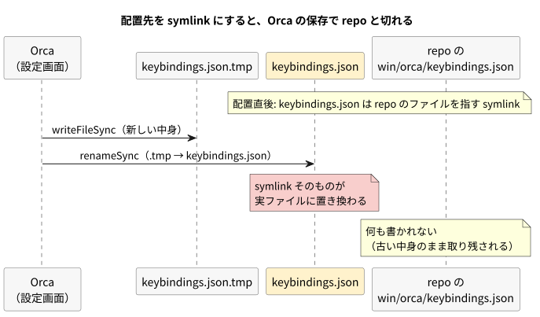
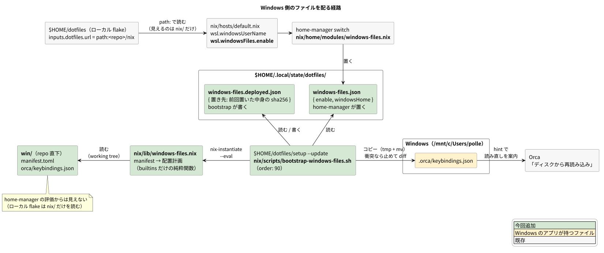
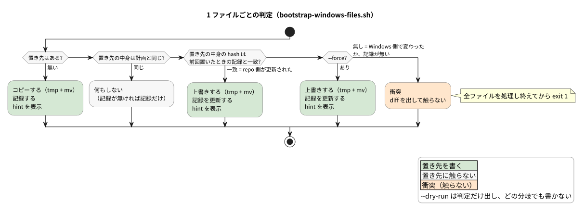

# ADR: Windows 側のアプリの設定を repo 直下の `win/` に置き、WSL の bootstrap が `/mnt/c` へコピーして配る

| 項目 | 内容 |
| --- | --- |
| ステータス | 提案 (Proposed) — レビュー中 |
| 日付 | 2026-09-28 (JST) |
| 決定者 | pollenjp |
| チケット | [TKT-31](https://app.notion.com/p/dotfiles-Windows-win-Orca-keybindings-json-3e779149a66f817993faed920e623f97)（最初に配る中身は [TKT-25](https://app.notion.com/p/Orca-worktree-Ctrl-Alt-Ctrl-Ctrl-W-3e779149a66f8177809ac8632bf68b2c)） |
| 前提 ADR | [002_nix_hosts_and_local_flake](../002_nix_hosts_and_local_flake_20260810T153848JST/README.md)（マシン固有の値は host option で明示する / ローカル flake は本体の `nix/` を `path:` で読む）、[007_claude_skill_host_option](../007_claude_skill_host_option_20260926T130250JST/README.md)（アプリが書き換えるファイルへは「Nix が値を置き、bootstrap が写す」） |
| 運用手順 | [`win/README.md`](../../../win/README.md)、[`nix/README.md`「Windows 側のファイルを配る」](../../../nix/README.md#windows-側のファイルを配る) |

> **追記 (2026-10-05、[TKT-82](https://app.notion.com/p/PowerShell-PROFILE-1-bootstrap-TKT-77-3ef79149a66f816d8b0bf7a8d68b20c5))**
>
> - PowerShell の共有設定 (`win/powershell/dotfiles.ps1`、TKT-77) を `$PROFILE` から読ませる
>   1 行だけは、bootstrap が `pwsh.exe` に `$PROFILE` の場所を聞いて足す
>   (`nix/scripts/bootstrap-windows-powershell-profile.sh`、order 95)。`$PROFILE` はドキュメントの下に
>   あり、その位置は OneDrive の設定でマシンごとに変わるので、manifest の `dst` にも host option にも書けない
> - 1-5「配る経路に Windows の exe を挟まない」は変えていない。ファイルを配る経路 (コピー) は
>   今のまま exe を通らず、この手順は別の手順として後に走る。interop が落ちていたら手で打つ
>   コマンドを出して exit 0 で飛ばす (配布も setup の後続も止めない)
> - 足した記録があるのに行が消えていたら、Windows 側で外したものとして足し直さない
>   (D の「衝突したら止める」と同じ考え方)。`--force` で足し直す

---

## 1. 背景 (Context)

### やりたかったこと

Windows 側のアプリの設定を dotfiles で管理し直したい。repo の直下に `win/` を作り、
その下に置いていく。

最初に配るのは Orca のキーバインド `C:\Users\polle\.orca\keybindings.json`。Orca は
Windows 側の Electron アプリで、この PC ではそこから WSL の Claude Code を起動している。
中身は TKT-25 で決めた (worktree の移動を Ctrl+Alt+↑↓、タブの移動を Ctrl+↑↓、Ctrl+W を
ターミナルへ渡す)。

これまで Windows 側へ設定を配る経路は、Git Bash 用の従来経路 (`main.bash setup`) だけ
だった。Windows 側に clone (`C:\Users\polle\dotfiles`) を置き、MINGW では symlink が
使えないので `cp -a` でコピーする。この clone は origin から 150 commit 遅れていた
(2026-09-26 時点)。

### 前提: WSL のある Windows 機だけを対象にする

WSL の無い Windows 機は想定しない (TKT-31 で決定)。配る元は WSL で、`/mnt/c` 越しに
書く。日々の入口 `~/dotfiles/setup --update` に入れられ、Windows 側の clone を更新し
続ける必要も無くなる。

### 設計を縛る事実

#### 1. 配置先を symlink にすると、Orca の保存で切れる

Orca は `keybindings.json` を `keybindings.json.tmp` に書いてから `rename` で置き換える
(Orca 1.4.212 の `resources/app.asar` の `out/main/index.js`)。`rename` は symlink
そのものを実ファイルで上書きするので、設定画面から一度保存すると repo との繋がりが
消える。配置先へは**コピーする**しかない。

```js
function Tra(e,t){(0,I.mkdirSync)((0,L.dirname)(e),{recursive:!0});let n=`${e}.tmp`;try{(0,I.writeFileSync)(n,`${JSON.stringify(t,null,2)}\n`,`utf8`),(0,I.renameSync)(n,e)}catch(e){…}}
```



Orca はこのファイルを監視していない。置いた後は設定画面の「ディスクから再読み込み」か
Orca の再起動が要る。

#### 2. Windows 側のファイルはアプリ自身が書き換える

Orca は設定画面の操作で `keybindings.json` を書き換える。Claude Code の `settings.json`
と同じ立場で、store への read-only な symlink は置けない。ADR 007 はこれを「Nix が値を
`~/.local/state/dotfiles/` に置き、bootstrap が写す」2 段で扱い、`home.activation` で
書く案を「Nix 管理か否かの線が崩れる」として退けた。

#### 3. home-manager の評価からは `win/` が見えない

`~/dotfiles/flake.nix` は本体を `path:<repo>/nix` で読む (ADR 002)。`path:` 入力の
source tree は `nix/` の中身だけなので、module から `../../../win` を指すと store の
外 (`/nix/store/win/…`) を指すことになり、評価が止まる。

```text
error: access to absolute path '/nix/store/win/manifest.toml' is forbidden in pure evaluation mode (use '--impure' to override)
```

`path:<repo>/nix` を input にした使い捨ての flake で確かめた。同じ repo を
`git+file:<repo>?dir=nix` で読むと repo 全体が source tree になり、`win/` も読めた。
CI の `nix flake check ./nix` は git の作業ツリーの中を指すのでこちらの形になる。
**CI では通るのにマシン上の switch で落ちる**ので、見落とすと気付くのが遅れる。

#### 4. Windows のユーザー名は host の宣言として持っている

`dotfiles.wsl.onePassword.windowsUserName` が `/mnt/c/Users/<名前>/` の組み立てに使われて
いる。Nix の評価は純粋なので、`cmd.exe` などで取らずに host ごとに書くのがこの repo の
流儀。`options.nix` 自身が、1Password 以外でも使うならこの入れ子から外へ出す、と
NOTE に書いていた。

#### 5. WSL の interop は落ちることがある

2026-09-26 の作業中も `cmd.exe` が `exec format error` で動かなかった (後で直した)。
配る経路に Windows の exe を挟まない。

## 2. 決定 (Decision)



### A. 設定の実体は repo 直下の `win/` に置き、置き先を `win/manifest.toml` で宣言する

```
win/
├── README.md              置き方・manifest の書き方・反映と衝突の扱い
├── manifest.toml          置き先の宣言
└── orca/
    └── keybindings.json   Orca のキーバインド (TKT-25)
```

```toml
# win/manifest.toml
[[files]]
src = "orca/keybindings.json"                  # win/ からの相対パス
dst = "%USERPROFILE%/.orca/keybindings.json"   # Windows 側の置き先
hint = "Orca の設定 → キーボードショートカット → 「ディスクから再読み込み」"
```

- `win/` が唯一の実体。`nix/files/` へは複製しない (home-manager はそもそも読めない。§1 の 3)
- `dst` は `%USERPROFILE%`・`%APPDATA%`・`%LOCALAPPDATA%` のどれかで始める。
  それぞれ `/mnt/c/Users/<windowsUserName>`、その下の `AppData/Roaming`・`AppData/Local`
  に解決する。区切りは `/`。`..` と `\` は書けない
- `hint` は任意。置き先を書き換えたときに bootstrap がそのまま表示する
  (Orca のように読み直しが要るアプリのため)
- 書けるキーは `src`・`dst`・`hint` だけ。綴り違い (`dest` など) を黙って無視しない
- 形式を TOML にしたのは、コメントが書けて、Nix の `builtins.fromTOML` でも
  Nix 以外の道具でも読めるから
- `keybindings.json` は Orca が書く形 (`JSON.stringify(…, null, 2)` + 改行) に揃える。
  Orca が同じ内容を書き直してもバイト列が変わらず、無用な衝突にならない
- 中身は TKT-25 の適用案で置く。TKT-25 に残っている未決の点が決まったら、このファイルを直す

### B. host option: Windows のユーザー名を `dotfiles.wsl` の直下へ上げ、配るかどうかを `dotfiles.wsl.windowsFiles.enable` で宣言する

```nix
# nix/hosts/default.nix
"pollenjp@wsl" = mkHome {
  username = "pollenjp";
  system = "x86_64-linux";
  wsl = {
    enable = true;
    windowsUserName = "polle";   # 上へ移した。/mnt/c/Users/<名前> の組み立てに使う
    windowsFiles.enable = true;  # 新設。win/ を Windows 側へ配るマシン
    onePassword.enable = true;   # windowsUserName は既定で上の値を引く
  };
};
```

- `dotfiles.wsl.windowsUserName` を足す (既定 `null`)。
  `dotfiles.wsl.onePassword.windowsUserName` は既定でこれを引く。今の書き方
  (`wsl.onePassword.windowsUserName = "…"`) もそのまま動き、書けばそちらが勝つ
- `dotfiles.wsl.windowsFiles.enable` を足す (既定 `false`)。`wsl.enable` と
  `windowsUserName` が揃っていなければ評価時に止める (assertion)
- 登録簿は `pollenjp@wsl` だけを変える。`pollenjp@wsl-no-1password` などは既定の
  `false` のままで、何も変わらない
- `mkHome` の引数は変えない。`wsl` の attrset がそのまま `dotfiles.wsl` に入るため

### C. home-manager は host の値だけを `~/.local/state/dotfiles/windows-files.json` に置く

新しい `nix/home/modules/windows-files.nix` は、全ホストで次の 1 ファイルを置く。

```json
{ "version": 1, "enable": true, "windowsHome": "/mnt/c/Users/polle" }
```

- `windowsFiles.enable = false` のホストでは `{"version": 1, "enable": false, "windowsHome": null}`。
  bootstrap が「まだ switch していない (ファイルが無い)」と「このマシンは配らない」を
  区別できるようにするため。ADR 007 の `claude-skill-overrides.json` が既定値の `"on"`
  でも書くのと同じ考え
- `win/` は読まない (§1 の 3)。switch は Windows 側にも触らない
- `/mnt/c` は固定。WSL の automount の root を変えているマシンが出てきたら option にする

### D. `bootstrap-windows-files.sh` が checkout の `win/` を読み、`/mnt/c` へコピーする。衝突したら止める

`nix/scripts/bootstrap-windows-files.sh` を足す。`setup.sh` は `bootstrap-*.sh` を
自動で列挙するので、`~/dotfiles/setup --update` に入る (`setup.sh` の編集は要らない)。

1. `~/.local/state/dotfiles/windows-files.json` を読む。無ければ「まだ switch していない」
   と言って exit 0、`enable` が `false` なら「このマシンは対象外」と言って exit 0
   (どちらも ADR 007 の bootstrap と同じ扱い)。`windowsHome` のディレクトリが無ければ
   exit 1 (`/mnt/c` が見えていないか、ユーザー名が違う)
2. 自分のいる checkout の `win/manifest.toml` を配置計画にする。計画を作るのは新しい
   純粋関数 `nix/lib/windows-files.nix` で、script は
   `nix-instantiate --eval --strict --json` で呼ぶ (0.04 秒ほど)。TOML の解釈、
   書けるキーの確認、`src` が通常のファイルとしてあること、`dst` の変数の解決、
   `..`・`\`・`dst` の重複の拒否をこの関数が受け持ち、違反は `throw` で止める。
   nixpkgs に頼らず builtins だけで書く
3. 1 ファイルずつ次の表で判定し、実行する

| 置き先 | 置き先の中身 | 前回置いた中身の記録 | すること |
| --- | --- | --- | --- |
| 無い | — | 問わない | コピーする。記録する |
| ある | 計画と同じ | 問わない | 何もしない (記録が無ければ記録だけする) |
| ある | 計画と違う | 置き先の今の中身と一致 | repo 側が更新された → 上書きする。記録を更新する |
| ある | 計画と違う | 無い、または一致しない | Windows 側で変わった → **衝突**。diff を出して触らない |



- 衝突の diff は `diff -u <置き先> <win/ のファイル>` の向き (`-` が Windows 側、`+` が repo 側)
- 置き先の親ディレクトリが無ければ作る (`windowsHome` の下に限る)
- 記録は `~/.local/state/dotfiles/windows-files.deployed.json` (`{"<置き先>": "<sha256>"}`)。
  script だけが書く。中身の hash で比べ、mtime は使わない (NTFS の mtime は同じ中身の
  保存でも変わる)
- 衝突が 1 件でもあれば、全ファイルを処理し終えてから exit 1 する。setup の結果一覧に
  失敗として出る。解き方は 2 つで、どちらもメッセージに出す
  - Windows 側の変更を残す: `cp <置き先> <repo>/win/<src>` で取り込んで流し直す
    (中身が揃うので記録だけが更新される)。取り込んだ変更は commit する
  - repo 側で上書きする: `bootstrap-windows-files.sh --force`
- 書き込みは置き先と同じディレクトリに一時ファイルを作ってから `mv` する。途中で落ちても
  壊れたファイルを残さない
- 置き先を書き換えたら、そのファイルの `hint` を表示する
- manifest から消したファイルは、Windows 側からは消さない (アプリが持つファイルなので)
- 引数は 3 つ。`--force` (衝突も上書き)、`--dry-run` (判定だけ出して何も書かない)、
  `--check` (manifest の検証だけ。state が無くても動き、`jq` も要らない)
- `# order: 90` で bootstrap の最後に走らせる。衝突の exit 1 がほかの bootstrap を
  止めないようにするため
- CI の lint ジョブで `bootstrap-windows-files.sh --check` を走らせ、workflow の対象パスに
  `win/**` を足す (足さないと manifest だけを変えた PR で CI が走らない)。home-manager の
  評価では manifest を読まないので、`nix flake check` だけでは manifest の誤りが switch の
  後まで見つからない

### E. 旧経路 (`main.bash` の MINGW 分岐と `C:\Users\polle\dotfiles`) は今回触らない

Git Bash の `.bashrc`・`.gitconfig` などを配っていて、`win/` はまだそれを持たない。
`win/` へ移し終えた時点で、別の ADR で畳む。

## 3. 変更点の詳細

| ファイル | 変更 |
| --- | --- |
| `win/README.md` | 新規。置き方、manifest の書き方、反映と衝突の扱い |
| `win/manifest.toml` | 新規。Orca の `keybindings.json` の 1 件 |
| `win/orca/keybindings.json` | 新規。TKT-25 の適用案 |
| `nix/lib/windows-files.nix` | 新規。`win/manifest.toml` から配置計画を作る純粋関数 (builtins だけ) |
| `nix/home/options.nix` | `dotfiles.wsl.windowsUserName` と `dotfiles.wsl.windowsFiles.enable` を追加。`onePassword.windowsUserName` の既定を前者にする |
| `nix/home/modules/windows-files.nix` | 新規。`~/.local/state/dotfiles/windows-files.json` を置く。assertion |
| `nix/home/default.nix` | 上の module を imports に足す |
| `nix/home/modules/git.nix` | assertion の案内を `wsl.windowsUserName` に合わせる |
| `nix/hosts/default.nix` | `pollenjp@wsl` を `wsl.windowsUserName` と `wsl.windowsFiles.enable = true` に。ヘッダの説明 |
| `nix/lib/mk-home.nix` | コメントの例を合わせる (引数は変えない) |
| `nix/scripts/bootstrap-windows-files.sh` | 新規。判定とコピー。`--force` / `--dry-run` / `--check`。`# order: 90` |
| `.github/workflows/nix.yml` | 対象パスに `win/**` を足し、lint ジョブで `bootstrap-windows-files.sh --check` |
| `nix/README.md` | 「Windows 側のファイルを配る」の節、新規マシンの手順表 (6.8)、「bootstrap の実行順」の表 (90) (6.7 の抜けも直す) |
| `README.md` | Windows 側のアプリの設定は `win/` にある、と案内 |
| `docs/adr/README.md` | 一覧に 010 |
| `docs/adr/010_…/` | この ADR と図 |

変えないもの: `setup.sh` (自動列挙で入る)、ローカル flake の雛形 (`setup-local-flake.sh`)、
`main.bash`、`nix/files/`。

## 4. 検討した代替案

| 案 | 採らなかった理由 |
| --- | --- |
| Windows 側の clone + PowerShell で配る | clone の更新が要り、今の clone のように取り残される。WSL の無い Windows 機は想定しない。symlink が張れても Orca の保存で切れる (§1 の 1) ので利点が無い |
| WSL と Windows の両方から配れるようにする | 今は WSL だけで足りる。manifest は TOML なので、要るようになってから Windows 側の runner を足せる |
| bootstrap だけで配り、host option を使わない | 「このマシンは Windows 側へ配らない」を表す場所が無い。ユーザー名を `cmd.exe` から取ると interop が落ちた日に配れない |
| `home.activation` で switch のたびにコピーする | switch は止めたくないので衝突を上書きするしかなく、Orca の設定画面で変えた分が消える。ADR 007 が退けた形でもある。そもそも評価から `win/` が見えない (§1 の 3) |
| home-manager が manifest を読み、ファイルを store に入れて計画を置く (レビュー前の案) | マシン上の switch は `path:<repo>/nix` を読むので `win/` が見えない (§1 の 3)。CI (`git+file`) では動くので気付きにくい |
| `win/` を `nix/` の下に置く | home-manager から見えるようになるが、Windows 側の設定が Nix の管理物の中に紛れる。repo 直下に置く、という依頼にも合わない |
| ローカル flake の入力を `nix/` から repo 全体に広げる | ADR 002 の「`nix/` を narHash で pin する」前提と、`setup.sh` の `sync_local_flake_lock` が変わる。既にある `~/dotfiles/flake.nix` は setup が書き換えないので、全マシンで手直しが要る |
| manifest を JSON にして `jq` で読む | コメントが書けない。検証を bash で書くことになる。Nix の `fromTOML` で読めば、検証を純粋関数に寄せられる |
| 配置先を symlink にする | Orca の tmp + rename の保存で実ファイルに置き換わる (§1 の 1)。Windows の symlink は開発者モードか管理者権限も要る |
| 衝突しても常に上書きする | Orca の設定画面で変えた分が黙って消える |
| 衝突を mtime で判定する | NTFS / drvfs の mtime は中身が同じ保存でも変わる。中身の hash で見る |
| Windows のユーザー名を `onePassword` の下に残し、`windowsFiles` 側にも別に持つ | 同じ値を 2 箇所に書くことになる |

## 5. 影響 (Consequences)

良くなること。

- Windows 側のアプリの設定が repo で追跡され、2 台目の WSL でも `~/dotfiles/setup --update` で揃う
- Windows 側に clone を置かなくてよい
- Orca の設定画面で変えた分は衝突として見える。黙って消えない
- 配るファイルを足すときに触るのは `win/` だけ。Nix も script も変えなくてよい

注意が必要なこと。

- 反映は 2 段。`home-manager switch` だけでは Windows 側に届かず、`~/dotfiles/setup --update`
  (bootstrap まで走る) で揃う。ADR 007 と同じ
- 配るのは、setup を走らせた checkout の `win/` の working tree。commit していない変更も
  配られる (ローカル flake が `nix/` を `path:` で読むのと同じ性質)。worktree から setup を
  走らせると、`win/` はその worktree のもの、host の値は `~/dotfiles` が指す checkout の
  ものになる (ほかの bootstrap と同じ)
- 置いたファイルをアプリが読み直すとは限らない。Orca は `hint` のとおり手で読み直す
- Windows 側で設定を変えると、次の `setup --update` はこの手順だけ失敗する。取り込むか
  `--force` で解く
- manifest の検証が走るのは配るときと CI (`--check`)。home-manager の評価では走らない
- Windows のユーザー名が違う 2 台目は、登録簿にホストを足すか、ローカル flake の `local` で
  `dotfiles.wsl.windowsUserName` を `lib.mkForce` で差し替える

## 6. 検証 (Verification)

`feat/TKT-31-win-files` で実施。テストは使い捨ての `HOME` で流す script で、repo には入れて
いない (ADR 007・009 と同じく結果をここに残す)。どれもテストを先に書き、実装前に落ちるのを
見てから通した。

| 確認 | 方法 | 結果 |
| --- | --- | --- |
| 計画を作る関数 | fixture の manifest を `nix-instantiate --eval --strict --json` で評価。正常系 (3 つの変数の解決、`hint` の有無、`[[files]]` が無い manifest、空白を含む `src` / `dst`) と異常系 (未知の変数、`src` / `dst` の `..`・末尾の `/`・`\`、`src` が無い・ディレクトリ・絶対パス、未知のキー、必須キーの欠け、`hint` の型、`dst` の重複と大文字小文字だけ違う重複、知らない表、`files` の型、manifest が無い、相対パスの引数) | 27 / 27 (実装前は 0 / 27) |
| bootstrap の判定 | 使い捨ての `HOME`、repo の形を真似た一時ディレクトリ、置き先を空白入りの一時ディレクトリに向けた state で: state 無し / `enable = false` / `windowsHome` 無し / 新規 (親ディレクトリも無い) / 2 回目は何もしない / 同じ中身で記録無し / repo 側の更新 / 衝突 (exit 1、置き先も記録も変わらない、`-` が Windows 側・`+` が repo 側の diff、取り込み方と `--force` の案内) / `--force` / 記録が無く中身が違う / 衝突があってもほかのファイルは処理する / `--dry-run` (置き先も記録も作らない) / `--dry-run` でも衝突は exit 1 / 記録が壊れている / manifest の無い checkout / 置き先がディレクトリ / `--check` (state も `jq` も無しで動く、manifest の誤りで exit 1) / 不明な引数は exit 2 / `sha256sum` の無いマシン (`enable = false` なら exit 0、`true` なら exit 1。レビューの指摘で足した) | 60 / 60 (実装前に通っていたのは「何も置かない」の類の 11 項目だけ。`sha256sum` の 5 項目は修正前に `enable = false` の 2 つが落ちるのを確認) |
| option と state | 登録簿のホストの `windows-files.json` の中身、assertion 2 つ (`windowsUserName` が無い / `wsl.enable = false`)、`onePassword.windowsUserName` の既定と上書きと今までの書き方 | 9 / 9 (実装前は 2 / 9) |
| 1Password の設定が変わらない | `pollenjp@wsl` の `git/config` の生成結果を変更の前に控え、後と比べる | バイト単位で同じ (上の 9 項目に含む) |
| 静的 | `nixfmt --check` / `shfmt -d` / `shellcheck` (CI と同じ集合)、workflow は `actionlint` | 指摘なし。`actionlint` は変更前からある SC2016 (info) の 1 件だけで、今回の差分からの指摘は無い |
| manifest の検証 | `nix/scripts/bootstrap-windows-files.sh --check` | `win/manifest.toml: OK (1 件)`。`win/` を置く前は「見つかりません」で exit 1 |
| flake / activation | `./nix/scripts/verify.sh` | `nix flake check --all-systems --no-build`・build・activate 2 回まで通過。配置一覧に `.local/state/dotfiles/windows-files.json` が出る (sandbox は非 WSL なので `{"enable":false,"version":1,"windowsHome":null}`)。最後の `~/dotfiles` 参照チェックは **main でも同じ 10 件で落ちる**既知の誤検知 |
| `setup.sh` の手順一覧 | `./nix/scripts/setup.sh --list` と、setup が使うのと同じ awk / sed で説明と order を抜く | `bootstrap-windows-files` が bootstrap の最後に並ぶ。説明は冒頭の 1 行、order は 90 |
| 実機の置き先への dry-run | 使い捨ての `HOME` の state を `/mnt/c/Users/polle` に向けて `--dry-run` | `[dry-run] コピー: /mnt/c/Users/polle/.orca/keybindings.json`、exit 0。Windows 側にも記録にも何も書かない |
| 実機 | `~/dotfiles/setup --update` → `/mnt/c/Users/polle/.orca/keybindings.json` が置かれる → Orca で再読み込み → Ctrl+Alt+↑↓・Ctrl+↑↓・Ctrl+W (TKT-25 の完了条件) | merge 後に確認する (Orca の再読み込みとキー操作はユーザーの操作が要る) |

## 7. 移行・運用手順

この PC (`pollenjp@wsl`) では 1 回流すだけでよい。

```sh
~/dotfiles/setup --update   # switch が windows-files.json を置き、bootstrap が keybindings.json を置く
```

置いた後、Orca の設定 → キーボードショートカット → 「ディスクから再読み込み」。

### ファイルを足す

```sh
cd ~/ghq/github.com/pollenjp/dotfiles
mkdir -p win/<アプリ>
cp /mnt/c/Users/polle/<置き先> win/<アプリ>/   # 今の設定から始めるなら
$EDITOR win/manifest.toml                     # [[files]] を 1 つ足す
nix/scripts/bootstrap-windows-files.sh --dry-run
~/dotfiles/setup --update
```

今の設定をそのまま取り込んだ場合、1 回目は「中身が同じ」なので記録だけが作られる。

### 衝突したら

```sh
# Windows 側の変更を残す
cp /mnt/c/Users/polle/.orca/keybindings.json win/orca/keybindings.json
nix/scripts/bootstrap-windows-files.sh        # 中身が揃い、記録だけが更新される
git add win/orca/keybindings.json && git commit

# repo 側で上書きする
nix/scripts/bootstrap-windows-files.sh --force
```

### 2 台目の WSL

- Windows のユーザー名が `polle` なら、`pollenjp@wsl` のまま `~/dotfiles/setup --update`
- 違うなら `~/dotfiles/flake.nix` の `local` で差し替えてから流す

  ```nix
  local = { lib, ... }: {
    dotfiles.wsl.windowsUserName = lib.mkForce "<名前>";
  };
  ```

- Orca の `keybindings.json` が既にあると、初回は衝突になる。diff を見て、取り込むか `--force`
