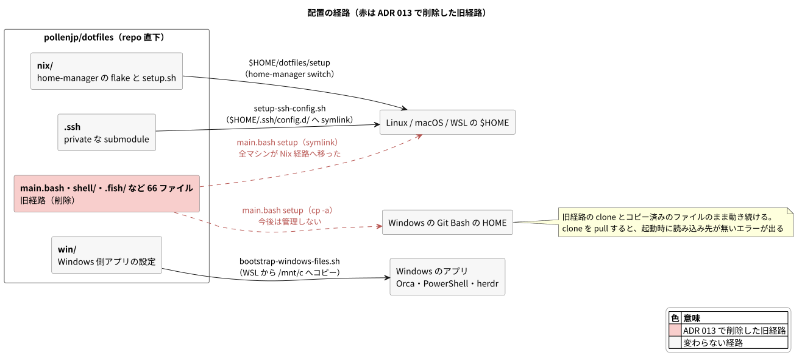

# ADR: 旧経路 (`main.bash setup`) を Windows の Git Bash 用も含めて削除し、配置を Nix 経路と `win/` だけにする

| 項目 | 内容 |
| --- | --- |
| ステータス | 提案 (Proposed) — レビュー中 |
| 日付 | 2026-10-07 (JST) |
| 決定者 | pollenjp |
| チケット | [TKT-117](https://app.notion.com/p/nix-win-main-bash-setup-3f179149a66f81e186b2d67aca2dbb18) |
| 前提 ADR | [001_home_manager_migration](../001_home_manager_migration_20260808T163454JST/README.md)（段階移行の Stage 6 で旧経路の削除を判断する。条件は全マシンの移行）、[003_nix_ssh_config](../003_nix_ssh_config_20260810T210714JST/README.md)（Windows 用の `ssh_config` と `bin/ssh-*-git-for-win.sh` は Windows を畳むときに消す）、[010_win_files_from_wsl](../010_win_files_from_wsl_20260928T003933JST/README.md)（E: Git Bash の設定を `win/` へ移し終えたら別の ADR で畳む） |
| 運用手順 | [`README.md`](../../../README.md)、[`nix/README.md`](../../../nix/README.md) |

---

## 1. 背景 (Context)

### 旧経路は「Windows 用」と「復旧用」として残っていた

ADR 001 は dotfiles を Nix home-manager へ段階的に移すにあたり、repo 直下の旧経路
(`main.bash setup`。`~/dotfiles` に clone して symlink を張り、rc ファイルへ追記する) を
次の 2 つの用途で残した。

- Windows (MINGW/MSYS) 用。Nix が動かないため（決定 4）
- 復旧用。どの段階でも `./main.bash setup` で戻せる状態を保つ（決定 7）

削除は段階移行の最後 (Stage 6) で判断し、その条件を「全マシンが移行し終えるまで削除しない」
としていた。

### 全マシンが Nix 経路へ移った

2026-10-07 の時点で、Linux / macOS / WSL に旧経路のままのマシンは残っていない（ユーザーに確認）。
こちらで確かめられたものは次のとおり。

| マシン | 経路 | 確かめ方 |
| --- | --- | --- |
| この PC (WSL、`pollenjp@wsl`) | Nix 経路 | `~/dotfiles` はローカル flake と `setup` の symlink だけ。rc ファイルに旧経路の追記が無い |
| gcp-sdbx-v2 の VM 2 台 | Nix 経路 | my-cloud の ansible が `setup.sh` を流す（my-cloud の `gcp-sdbx-v2/README.md`） |

ghq 配下の他の repo (my-cloud・nixos-config など) にも、旧経路のファイルを指す参照は無かった。

### 二重管理のまま、旧経路の側は直していなかった

移行期間中は、同じ設定が repo 直下と `nix/` の 2 か所にあった。ADR 001 は「片方だけ直す事故に
注意」としたが、実際には ADR 008 のように「レガシー経路を触らない」と決めて `nix/` の側だけを
直してきた。`4a54c96` の時点で、`.config/zellij/config.kdl` は `nix/files/zellij/config.kdl` と
23 行、`.config/nvim/init.vim` は `nix/files/nvim/init.vim` と 2 行ずれていた。旧経路は
「戻れば前の状態になる」場所ではなく、古いまま止まった設定になっていた。

### Windows の Git Bash だけが旧経路を読んでいる

この PC の Windows 側では、Git Bash がまだ旧経路を読んでいる。

- `C:\Users\polle\.bashrc` は、旧経路が追記した stanza で `C:\Users\polle\dotfiles\.bashrc`
  （旧経路の clone）を起動のたびに source する
- `C:\Users\polle\.gitconfig` は、`gitdir:~/workdir/github.com/pollenjp-sub` のときに同じ clone の
  `.gitconfig.pollenjp-sub.github.com` を include する
- MINGW では symlink が使えないので、`.vimrc` などは `cp -a` でコピーしてある

clone は 2026-03-21 の `986a1cf` で止まっており、origin から 150 commit 遅れていた
（未 push の commit 2 件は `.gitconfig` の整形だけ）。ADR 010 の E は、Git Bash の設定を `win/` へ
移し終えてから別の ADR で畳むとしていたが、移す作業は進んでいなかった。WSL の無い Windows 機は
TKT-31 で対象外にしている。

## 2. 決定 (Decision)



### A. 旧経路のファイル 66 件を、Windows の Git Bash 用も含めて削除する

ADR 001 の Stage 6 として、repo 直下の旧経路を消す。

| 消したもの | 件数 | Nix 経路での置き場所 |
| --- | --- | --- |
| `main.bash`・`Makefile`・`script/utils.bash` | 3 | `nix/scripts/setup.sh` |
| `.bashrc`・`.bash/`・`shell/` | 21 | `nix/home/modules/bash.nix`・`shell-common.nix` |
| `.fish/`・`.config/fish/` | 19 | `nix/home/modules/fish.nix` |
| `.gitconfig`・`.gitconfig.pollenjp-sub.github.com`・`.gitignore_global` | 3 | `nix/home/modules/git.nix` |
| `.vimrc`・`.vim/`・`vim_common/` | 4 | `nix/files/vim/` |
| `tmux/`・`.screenrc` | 3 | `nix/files/tmux/`・`nix/files/screenrc` |
| `.config/starship.toml`・`.config/zellij/`・`.config/nvim/` | 3 | `nix/files/` |
| `bin/ssh-wsl.sh`・`bin/ssh-add-wsl.sh`・`ssh_config` | 3 | `nix/home/modules/ssh.nix`・`setup-ssh-config.sh`（ADR 003 / 004） |
| `.config_tmpl/mise/config.toml` | 1 | `nix/scripts/bootstrap-mise.sh` |
| `_vimrc_for_windows`・`bin/ssh-git-for-win.sh`・`bin/ssh-add-git-for-win.sh`・`script/install-pacman-for-git-bash.sh` | 4 | なし（Windows の Git Bash 用） |
| `.config/pypoetry/` | 2 | なし（Nix 経路では配っていなかった） |

`.gitignore` の `/.cache` も消す。`main.bash` が bash-completion を落とす置き場だった。

### B. Git Bash の設定は `win/` へ移さず、管理をやめる

ADR 010 の E が描いた「先に `win/` へ移す」順番は取らない。Git Bash の設定は clone とコピーの
まま凍結しており、育て直す理由が薄いため。今の Git Bash は、clone を pull しない限りそのまま動く。
要るものが出てきたら、そのときに `win/manifest.toml` へ足す。

### C. 残すもの

| 残したもの | 理由 |
| --- | --- |
| `.ssh` submodule と `.gitmodules` | Nix 経路の `setup-ssh-config.sh` が `~/.ssh/config.d/` へ張る（ADR 003）。my-cloud の ansible も前提にしている |
| `.editorconfig` | shfmt の設定と、`win/` の `*.ps1` を BOM 付きにする設定 |
| `.github/`・`docs/`・`README.md` | CI・記録・入口（README は書き直した） |
| `nix/scripts/preflight-unlink.sh` と、旧 clone から移る手順 | 古い clone で旧経路を使っているマシンを移すときに、まだ要る |
| `nix/` の「複製元:」コメントと、`nix/README.md` の移植の記録 | 旧経路のファイルは `4a54c96` までの履歴で読める |

### D. 旧経路を止めるためだけにあった `nix/home/modules/mise.nix` を消す

`~/.local/state/dotfiles/package-manager`（中身は `nix`）を置くだけの module で、読むのは旧経路の
`shell/060_mise.sh`・`252_alias_mise.sh`（fish も）だけだった。既存のマシンでは、次の switch で
home-manager がマーカーを消す。

### E. 過去の ADR は書き換えず、冒頭にポインタを置く

決定が終わる ADR 001（決定 4・7）・003（Windows 用の ssh の 2 本）・010（E）の冒頭に、この ADR への
ポインタを置く。手順書として読まれる部分（ADR 001 の「7. 移行・運用手順」のロールバックと
`textbook/`）だけは現行の形に合わせる。

## 3. 変更点の詳細

| ファイル | 変更 |
| --- | --- |
| 旧経路の 66 ファイル | 削除（2.A の表） |
| `.gitignore` | `/.cache` を削除 |
| `nix/home/modules/mise.nix` | 削除 |
| `nix/home/default.nix` | `./modules/mise.nix` の import を削除 |
| `nix/home/modules/claude.nix` | 置き場の例に挙げていた mise.nix のマーカーを `windows-files.json` に差し替え（コメントだけ） |
| `nix/home/modules/files.nix` | 「複製元は vim_common/ にあり」を過去形に（コメントだけ） |
| `README.md` | 2 経路の表と従来経路の Setup をやめ、Nix 経路・`win/`・`.ssh`・`docs/adr` の案内だけにした |
| `nix/README.md` | 冒頭（旧経路と独立 → 旧経路は削除）、対象範囲（Git Bash は管理しない）、ssh の節（Git for Windows 用は削除）、mise の節（マーカーと `.config_tmpl` の注意書き）、構成図（`mise.nix`・`files/` の説明） |
| `docs/adr/001_…/README.md` | 冒頭に後続 ADR のポインタ。ロールバックを 2 段階にした |
| `docs/adr/001_…/textbook/` | `00`・`04` に旧経路を削除したことを書いた。`03` の構成図から `mise.nix` を外した。`05` の `./main.bash fmt` を devShell の shfmt にした。図 `04_cutover` の最終手段を注記に変えた |
| `docs/adr/003_…/README.md`・`docs/adr/010_…/README.md` | 冒頭に後続 ADR のポインタ |
| `docs/adr/README.md` | 一覧に 013 |

## 4. 検討した代替案

| 案 | 採らなかった理由 |
| --- | --- |
| 先に Git Bash 用の `.bashrc` などを `win/` に作ってから消す（ADR 010 の E の順番） | Git Bash の設定は半年以上 pull されないまま凍結しており、育て直す理由が薄い。PR も 1 本増える。要るものが出てきたら、そのときに `win/` へ足せる |
| Git Bash が読むもの（`shell/`・`.bash/`・`.gitconfig` など約半分）だけ残す | 旧経路が中途半端に残り、README にも従来経路の説明が残り続ける。残す範囲を決める議論も要る |
| 消さずに置いておく | 二重管理のまま、旧経路の側だけが古くなっていく。repo を開いた人が、どれが現役か迷う |

## 5. 影響 (Consequences)

### 良くなること

- 配置の経路が Nix 経路（Linux / macOS / WSL）と `win/`（Windows のアプリ）の 2 本だけになり、
  README から「マシンごとに経路を選ぶ」話が消える
- 同じ設定が 2 か所にある状態が終わり、片方だけ直す事故が起きなくなる
- repo 直下を開いたときに、現役のものだけが並ぶ

### 注意が必要なこと

- **Windows の Git Bash の設定は、誰も管理しなくなる。** `C:\Users\polle\dotfiles` で `git pull`
  すると、`.bashrc` の stanza が消えたファイルを source して、起動のたびに
  `No such file or directory` が出る（シェル自体は起動する）。`.gitconfig` が include する
  `.gitconfig.pollenjp-sub.github.com` も消え、`~/workdir/github.com/pollenjp-sub` の下での commit の
  名前が主アカウントに戻る。この clone は pull しないこと
- **`./main.bash setup` で戻ることはできなくなる。** 戻すのは home-manager の世代
  （`home-manager generations`）か `home-manager uninstall` になる。旧経路のファイルは `4a54c96`
  までの履歴にある
- **古い clone で旧経路を使っているマシンが見つかったら**、`nix/README.md` の
  「`~/dotfiles` を用意する」の手順（本体を ghq 配下へ移す → `preflight-unlink.sh` → switch）で移す。
  移す前にそのマシンで clone を pull すると、symlink が切れて設定が効かなくなる
- **pypoetry の設定（`virtualenvs.in-project = true` と testpypi）は Nix 経路で配っていない。**
  要るなら `nix/files/` に足す。この PC の `~/.config/pypoetry` は、`~/dotfiles/.config/pypoetry` を
  指す切れた symlink として残っている

## 6. 検証 (Verification)

CI と同じ手順を手元で流し、すべて通った。

- `nix flake check --all-systems --no-build ./nix` と `nix flake check --no-eval-cache ./nix`
  （x86_64-linux のビルドと `checks` のテスト）
- sandbox の activationPackage を使い捨ての `$HOME`（`/tmp/hm-sandbox`、`XDG_RUNTIME_DIR` は
  systemd のソケットが無い場所）へ 2 回 activate した。`.local/state/dotfiles/package-manager` は
  置かれなかった。`config.warnings` は `[]`
- lint ジョブと同じ `nixfmt --check`・`shfmt -d`・`shellcheck`（`nix/` の `*.sh` 33 本）・
  `bootstrap-windows-files.sh --check`・`check-herdr-keys.sh`
- `docs/adr` の外で、消したファイルを指す記述は「複製元:」のコメントと、旧 clone から移る手順だけに
  なった（`git grep` で確認）
- 図 `01_routes` と、更新した ADR 001 の図 `04_cutover` は PNG で書き出して目で確認した

### 確かめていないこと

- 実機での switch（マーカーが消えること）。merge した後に、下の手順で確かめる
- Windows の Git Bash は触っていない

## 7. 移行・運用手順

```sh
# merge した後: 本体を最新にして switch する (マーカーが消える)
~/dotfiles/setup --self-update --update
test -e ~/.local/state/dotfiles/package-manager || echo "マーカーは消えた"

# 旧経路のファイルを読みたいとき
git -C ~/ghq/github.com/pollenjp/dotfiles show 4a54c96:shell/250_alias.sh
git -C ~/ghq/github.com/pollenjp/dotfiles ls-tree -r --name-only 4a54c96 -- shell .fish
```

Windows の Git Bash の側では何もしなくてよい。`C:\Users\polle\dotfiles` では `git pull` しない。
