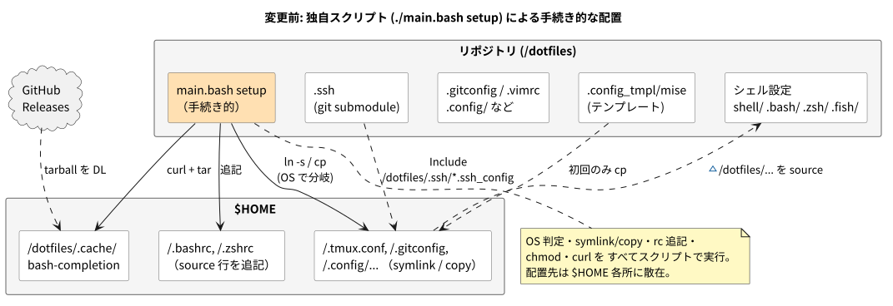
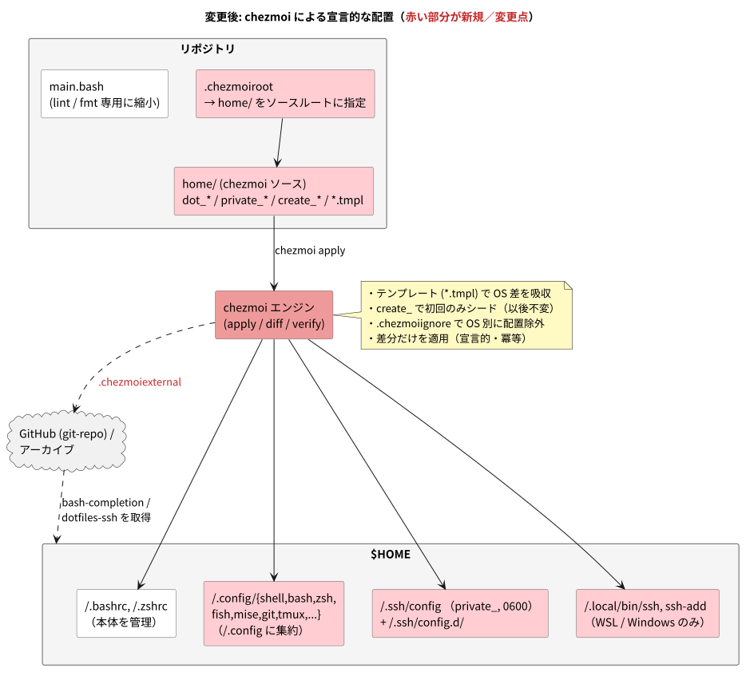

# ADR: dotfiles 管理を chezmoi ベースへ移植する

| 項目 | 内容 |
| --- | --- |
| ステータス | 提案中 (Proposed) — draft PR [#17](https://github.com/pollenjp/dotfiles/pull/17) |
| 日付 | 2026-07-19 (JST) |
| 決定者 | pollenjp |
| 関連 | PR #17 / ブランチ `claude/dotfiles-chezmoi-migration-95xj5i` |
| 補足資料 | [textbook/](./textbook/README.md)（新規参画者向けの解説） |

---

## 1. 背景 (Context)

これまでの dotfiles は、独自スクリプト `./main.bash setup` によって配置していた。
このスクリプトは次のような処理を **すべて手続き的に** 行っていた。

- `~/.bashrc` / `~/.zshrc` へ「リポジトリ側のローダを `source` する行」を追記
- OS を判定し、Unix では **symlink**、Windows では **copy** でファイルを配置
- `~/.ssh` の作成と `chmod`、`~/.ssh/config` への `Include` 行の先頭挿入
- bash-completion を `curl` + `tar` で手動ダウンロード
- `.ssh`（秘匿設定）を **git submodule** で取り込み
- mise の設定は `.config_tmpl/mise/config.toml` を初回のみ `cp`

### 現状（変更前）の構造



### 課題

1. **手続き的で分岐が多い** — OS ごとの symlink/copy 分岐、rc 追記のための自己参照ガード、`chmod`、`curl` などが 1 つのシェルスクリプトに集約され、見通しが悪い。
2. **OS 差分が手作業** — 例えば `.gitconfig` の 1Password `op-ssh-sign` のパスは、WSL / Windows でコメントを手で切り替える運用だった（コミット事故の温床）。
3. **配置状態が不透明** — 何がどこに symlink/copy されたかを一覧・検証する手段がない。「適用前に差分を見る」ができない。
4. **ハードコードされたパス** — 多くの設定が `~/dotfiles/...` を直接参照しており、リポジトリの置き場所に強く依存していた。
5. **外部依存の取得が場当たり的** — bash-completion の `curl`、`.ssh` の submodule など、取得手段がバラバラ。

---

## 2. 決定 (Decision)

dotfiles の管理を [chezmoi](https://www.chezmoi.io/) ベースへ全面移植する。あわせて次を採用する。

1. **`~/.config` 中心の idiomatic なレイアウト（B案）** — シェル断片やツール設定を `~/dotfiles/...` から `~/.config/...` へ移し、ハードコード参照をすべて更新する。
2. **`.chezmoiroot` で `home/` をソースルートに限定** — `main.bash` などの開発用ファイルは chezmoi 管理外としてリポジトリ直下に残す。
3. **symlink ではなく「管理されたコンテンツ」＋テンプレート** — OS 差分は Go テンプレート (`*.tmpl`) で吸収する。
4. **`create_` で「初回シードのみ」を表現** — 実行時に書き換わる/マシンローカルなファイル（mise の `config.toml`、`~/.common_shellrc.sh`）を保護する。
5. **`.chezmoiexternal.toml` で外部リソースを宣言的に取得** — bash-completion（アーカイブ）と `dotfiles-ssh`（git-repo）。従来の `.ssh` submodule は削除。
6. **`~/.ssh/config` を chezmoi 管理下に置く（`private_`, 0600）** — マシンローカルなエントリは `~/.ssh/config.d/*.ssh_config` に分離する。

### 変更後の構造（赤い部分が新規／変更点）



---

## 3. 変更点の詳細 (What changed)

| 変更前の仕組み | 変更後（chezmoi） |
| --- | --- |
| `main.bash setup`（symlink/copy + rc 追記） | `chezmoi apply`。`home/` を chezmoi ソースツリー化 |
| シェル設定を `~/dotfiles/{shell,.bash,.zsh,.fish}` から source | `~/.config/{shell,bash,zsh,fish/fragments}` へ集約し参照更新 |
| `~/.bashrc` / `~/.zshrc` に source 行を追記 | `dot_bashrc` / `dot_zshrc` として本体を管理 |
| `.gitconfig` の OS 別パスを手動コメント切替 | `dot_gitconfig.tmpl` で OS 別に自動選択 |
| mise 設定を初回のみ `cp` | `dot_config/mise/create_config.toml`（初回のみ生成、以後不変） |
| `~/.common_shellrc.sh` を `touch` で空作成 | `create_dot_common_shellrc.sh`（既存を上書きしない） |
| bash-completion を `curl` + `tar` | `.chezmoiexternal.toml`（type=archive, refreshPeriod） |
| `.ssh` git submodule | `.chezmoiexternal.toml`（type=git-repo）で `dotfiles-ssh` を取得 |
| `~/.ssh/config` に `Include` を先頭追記 | `private_dot_ssh/private_config` で `~/.ssh/config` を管理（0600） |
| WSL/Win の ssh ラッパを条件付きで配置 | `dot_local/bin/*.tmpl` + `.chezmoiignore` で対象 OS のみ配置 |
| `main.bash`（setup/lint/fmt） | `main.bash` は lint/fmt 専用に縮小 |

---

## 4. 検討した代替案 (Alternatives considered)

| 案 | 概要 | 不採用の理由 |
| --- | --- | --- |
| 現状維持（`main.bash` 継続） | 独自スクリプトを改善して使い続ける | 手続き的・分岐過多・差分確認不可という根本課題が残る |
| GNU Stow | symlink farm 管理 | テンプレート/OS 分岐/外部取得/秘匿情報の仕組みが無く、結局スクリプトが必要 |
| dotbot / yadm | 宣言的 install / git ラッパ | テンプレートや password-manager 連携は chezmoi が最も充実。既に 1Password を利用中で親和性が高い |
| A案（`~/dotfiles` 配置を維持） | 参照を書き換えず最小移行 | 動くが非 idiomatic。今回は本格移行のため B案（`~/.config`）を選択 |
| symlink モード（`chezmoi` の `symlink_`） | 直接編集の即時反映を維持 | 標準の `chezmoi edit`/`apply` 運用に寄せる方針。必要になれば後から切替可能 |

---

## 5. 影響 (Consequences)

### 良くなること

- OS 差分（1Password パス、ssh ラッパの配置）がテンプレート/`.chezmoiignore` で自動化され、手作業のコメント切替が不要になる。
- `chezmoi diff` / `chezmoi verify` / `chezmoi managed` により、**適用前の差分確認**と**管理状態の可視化**ができる。
- bash-completion の手動 DL が宣言的な external に置き換わり、`refreshPeriod` で自動更新される。
- Windows が一級市民になり、symlink/copy の分岐ロジックが不要になる。
- 既に利用中の 1Password と将来的に `onepasswordRead` 等で連携できる余地が生まれる。

### 注意が必要なこと（レビュー対象）

- ⚠️ **`~/.ssh/config` を chezmoi が所有する。** 既存の `~/.ssh/config` は置き換わる。マシンローカルなエントリは `~/.ssh/config.d/*.ssh_config` へ退避する運用に変わる。初回は必ず `chezmoi diff` で確認すること。
- ⚠️ **`.ssh` submodule → external（git-repo）。** SSH 鍵が未設定だと `dotfiles-ssh` の clone に失敗する（ただし他の適用は成功する）。鍵設定後に再 `apply`、または `chezmoi apply --exclude=externals` で回避できる。
- **編集ワークフローの変化。** これまでの symlink 直接編集ではなく、`chezmoi edit <target>` → `chezmoi apply` になる。
- 空ファイル（`~/.vim/.gitkeep` 等）は `empty_` 属性を付けないと配置されない、という chezmoi の仕様に注意（本移行では対応済み）。

---

## 6. 検証 (Verification)

chezmoi v2.71.0 をビルドし、サンドボックスの `$HOME` に対して検証した。

- `chezmoi apply` が成功（93 エントリを配置）
- `chezmoi verify` が exit 0（配置結果がソース状態と一致）
- 再 `apply` が冪等（差分なし）
- 配置物に `~/dotfiles/...` 参照が残っていないことを確認
- `~/.ssh/config` の権限が 0600、`~/.config/mise/config.toml` が `create_` で生成されることを確認
- 変更した shell スクリプトと、レンダリング後の ssh ラッパに対し `bash -n` が通過
- テンプレート（`dot_gitconfig.tmpl`、`.chezmoiignore`、ssh ラッパ）が期待どおり OS 分岐することを `chezmoi execute-template` で確認
- 外部リソース（bash-completion / dotfiles-ssh）はネットワーク/鍵の都合で取得検証は未実施（TOML/テンプレートの parse は確認済み）

---

## 7. 移行・運用手順

```sh
# chezmoi 導入（いずれか）
mise use -g chezmoi
sh -c "$(curl -fsLS get.chezmoi.io)"

# clone → 差分確認 → 適用
chezmoi init pollenjp
chezmoi diff            # 特に ~/.ssh/config を確認
chezmoi apply -v

# 日常
chezmoi edit ~/.zshrc
chezmoi apply -v
chezmoi cd              # ソースで git 操作
```

---

## 8. 参考 (References)

- chezmoi 公式: <https://www.chezmoi.io/>
- 特殊ファイル: <https://www.chezmoi.io/reference/special-files/>
- 本 ADR の入門ドキュメント: [textbook/README.md](./textbook/README.md)
- 図の再生成: [`plantuml/`](./plantuml/) で `mise run plantuml:generate`（`plantuml/mise.toml` 参照）
