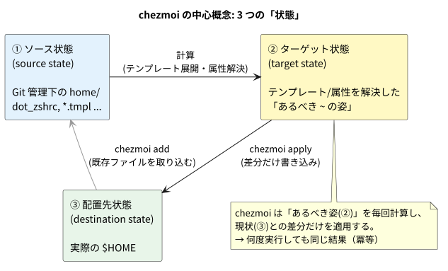
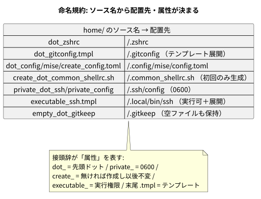
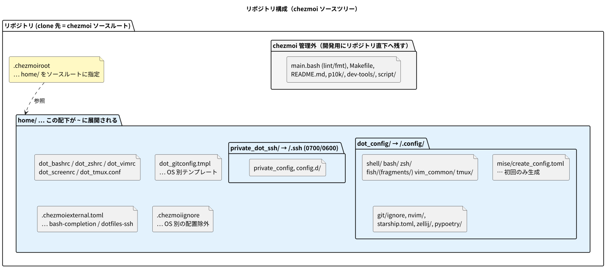
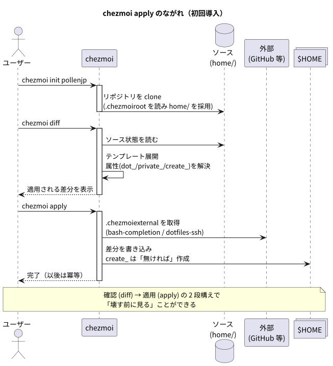

# Textbook: chezmoi ではじめる dotfiles 管理

> このドキュメントは、**dotfiles や chezmoi を初めて触る人** が、ゼロから順番に理解できることを目指した教科書です。専門用語は、出てきたすぐ下に「▶ 用語」の折りたたみ（クリックで開く）で解説します。

関連: この変更の意思決定は [../README.md](../README.md)（ADR）を参照してください。

---

## 0. この章で学ぶこと

1. そもそも dotfiles とは何か
2. chezmoi とは何で、従来のやり方と何が違うのか
3. chezmoi の中心概念（3 つの状態）
4. 「ファイル名の付け方（命名規約）」で配置先が決まる仕組み
5. このリポジトリの構成と、`chezmoi apply` の流れ
6. このリポジトリ特有のポイント
7. ハンズオン（実際に導入してみる）

---

## 1. dotfiles とは

`.bashrc` や `.gitconfig` のように、**先頭がドット（`.`）で始まる設定ファイル**の総称です。ホームディレクトリ（`~`）に置かれ、シェルやツールの挙動を決めます。これらを 1 つの Git リポジトリにまとめ、複数マシンで同じ環境を再現できるようにしたものが「dotfiles リポジトリ」です。

<details>
<summary>▶ 用語: ホームディレクトリ / <code>~</code></summary>

ユーザーごとの作業領域。Linux/macOS では `/home/ユーザー名` や `/Users/ユーザー名`。`~`（チルダ）はそのパスの短縮表記です。

</details>

<details>
<summary>▶ 用語: シェル (shell)</summary>

キーボードから打ったコマンドを解釈して実行するプログラム。`bash` / `zsh` / `fish` などがあります。起動時に `.bashrc` などの設定ファイルを読み込みます。

</details>

### なぜ「管理」が必要なのか

- 新しい PC でも同じ環境をすぐ再現したい
- 変更履歴を残し、壊れても戻せるようにしたい
- OS（Linux / macOS / WSL / Windows）ごとの差分をうまく扱いたい

この「配置」と「差分の扱い」をどうやるかが、dotfiles 管理ツールの主題です。

---

## 2. chezmoi とは

[chezmoi](https://www.chezmoi.io/)（シェモアと読む）は、dotfiles を**宣言的**に管理するツールです。「どのファイルがどこに、どんな内容・権限であるべきか」を Git リポジトリに記述しておき、`chezmoi apply` で実際のホームに反映します。

<details>
<summary>▶ 用語: 宣言的 (declarative)</summary>

「どうやるか（手順）」ではなく「どうあるべきか（あるべき状態）」を書くスタイル。chezmoi は現状との差分を自動計算して埋めるので、手順を自分で書く必要がありません。対義語は「手続き的 (imperative)」。

</details>

### 従来のやり方（このリポジトリの変更前）との違い

変更前は `./main.bash setup` という**手続き的なスクリプト**が、OS 判定・symlink 作成・`chmod`・`curl` などを順番に実行していました。chezmoi ではこれらを**ファイルの命名規約とテンプレート**で表現し、エンジンに任せます。

<details>
<summary>▶ 用語: symlink（シンボリックリンク）</summary>

「別のファイルへの参照（ショートカット）」となる特殊なファイル。従来は `~/.tmux.conf` をリポジトリ内の実体へ symlink していました。chezmoi は原則コピー（管理されたコンテンツ）で扱います。

</details>

---

## 3. 中心概念: 3 つの「状態」

chezmoi を理解する鍵は、次の 3 つの状態です。



1. **ソース状態 (source state)** — Git 管理下の設計図（このリポジトリの `home/`）。
2. **ターゲット状態 (target state)** — テンプレートや属性を解決した「あるべき `~` の姿」。
3. **配置先状態 (destination state)** — 実際の `$HOME` の現状。

chezmoi は ②「あるべき姿」を毎回計算し、③ 現状との**差分だけ**を適用します。だから何度実行しても結果が同じになります。

<details>
<summary>▶ 用語: 冪等 (idempotent / べきとう)</summary>

「同じ操作を何回繰り返しても結果が変わらない」性質。`chezmoi apply` は冪等なので、2 回目以降は「変更なし」で安全に再実行できます。

</details>

---

## 4. 命名規約: ファイル名で配置先と属性が決まる

chezmoi の最大の特徴が **ソースのファイル名で挙動が決まる** ことです。接頭辞（prefix）や接尾辞が「属性」を表します。



主な属性は次のとおりです。

| ソース名の例 | 配置先 | 意味 |
| --- | --- | --- |
| `dot_zshrc` | `~/.zshrc` | `dot_` → 先頭ドット |
| `private_config` | `…/config`（0600） | `private_` → 他ユーザーに読ませない権限 |
| `create_config.toml` | 無ければ作成 | `create_` → **初回のみ生成、以後は触らない** |
| `executable_ssh` | `…/ssh`（実行可） | `executable_` → 実行権限を付与 |
| `dot_gitconfig.tmpl` | `~/.gitconfig` | 末尾 `.tmpl` → テンプレートとして展開 |

<details>
<summary>▶ 用語: 接頭辞 (prefix)</summary>

ファイル名の先頭に付ける目印。chezmoi は `dot_` `private_` `create_` `executable_` `empty_` などを解釈して、配置先の名前・権限・振る舞いを決めます。

</details>

<details>
<summary>▶ 用語: テンプレート (template) / <code>.tmpl</code></summary>

`{{ ... }}` を埋め込める設定ファイル。chezmoi は Go の text/template を使い、OS 名 (`.chezmoi.os`) などの情報で内容を出し分けます。例: WSL のときだけ 1Password の署名パスを書き込む。

</details>

<details>
<summary>▶ 用語: <code>create_</code> と「初回シード」</summary>

`create_` を付けたファイルは、**存在しなければ作られ、既にあれば一切上書きされません**。実行時に書き換わる設定（mise のバージョン固定）やマシン固有設定を守るのに使います。

</details>

---

## 5. このリポジトリの構成

`home/` 以下が chezmoi のソースです。リポジトリ直下の `main.bash` などは開発用で、chezmoi の管理対象外です。この「管理対象の境界」を決めているのが `.chezmoiroot` です。



<details>
<summary>▶ 用語: <code>.chezmoiroot</code></summary>

リポジトリのどのサブディレクトリを「ソースルート」にするかを指定する特殊ファイル。中身は `home` の 1 行だけ。これにより `home/` 配下だけが `~` に展開され、`main.bash` や `README.md` は無視されます。

</details>

<details>
<summary>▶ 用語: <code>~/.config</code>（XDG Base Directory）</summary>

多くのツールが設定を置く標準ディレクトリ。ホーム直下を散らかさない現代的な慣習で、今回の移行ではシェル断片もここに集約しました（B案）。

</details>

---

## 6. `chezmoi apply` の流れを追う

導入から適用までの流れは次のとおりです。



- `chezmoi init pollenjp` … GitHub の `pollenjp/dotfiles` を clone（`.chezmoiroot` を読んで `home/` を採用）。
- `chezmoi diff` … テンプレート展開・属性解決を行い、**適用したら何が変わるか**を表示。
- `chezmoi apply` … 差分を書き込み、`.chezmoiexternal` の外部リソースを取得。

<details>
<summary>▶ 用語: <code>.chezmoiexternal.toml</code></summary>

リポジトリに含めない外部ファイルを宣言的に取得する仕組み。`type = "archive"`（tar 等の展開）や `type = "git-repo"`（別リポジトリの clone）を指定でき、`refreshPeriod` で自動更新します。本リポジトリでは bash-completion と秘匿 ssh 設定（`dotfiles-ssh`）に使用。

</details>

「見てから適用する（diff → apply）」の 2 段構えにより、**壊す前に確認**できるのが従来スクリプトとの大きな違いです。

---

## 7. このリポジトリ特有のポイント

### 7-1. `~/.config` への集約と参照の書き換え

シェル断片は `~/dotfiles/{shell,.bash,.zsh,.fish}` から `~/.config/{shell,bash,zsh,fish/fragments}` へ移動しました。`~/.bashrc` のローダも新パスを読むよう更新済みです。

```bash
# ~/.bashrc（抜粋・変更後）
for rc in ~/.config/shell/0[0-9][0-9]_*.sh; do . "${rc}"; done
for rc in ~/.config/bash/*.sh; do . "${rc}"; done
```

### 7-2. テンプレートで OS 差分を吸収（`dot_gitconfig.tmpl`）

1Password の署名バイナリのパスを OS で自動選択します。以前は手でコメントを外していた箇所です。

```gotmpl
{{- if eq .chezmoi.os "windows" }}
  program = "C:/.../op-ssh-sign.exe"
{{- else if eq .chezmoi.os "linux" }}
{{-   if contains "microsoft" (lower (default "" .chezmoi.kernel.osrelease)) }}
  program = "/mnt/c/.../op-ssh-sign-wsl.exe"   # WSL のときだけ
{{-   end }}
{{- end }}
```

<details>
<summary>▶ 用語: WSL (Windows Subsystem for Linux)</summary>

Windows 上で Linux を動かす仕組み。Linux として振る舞うため、chezmoi ではカーネル情報 (`.chezmoi.kernel.osrelease`) に `microsoft` が含まれるかで判定します。

</details>

<details>
<summary>▶ 用語: 1Password op-ssh-sign</summary>

1Password が提供する SSH 署名ツール。Git コミットに SSH 鍵で署名する際に使われ、実行ファイルの場所が OS ごとに異なります。

</details>

### 7-3. `create_` で「初回シード」（mise / common_shellrc）

mise の `config.toml` は起動時にバージョンが書き換わるため、`create_` で初回のみ配置し、以後 chezmoi は触りません。`~/.common_shellrc.sh`（マシンローカル設定）も同様です。

<details>
<summary>▶ 用語: mise</summary>

言語ランタイムや CLI ツールのバージョンを管理するツール（旧 rtx）。プロジェクトごとに `config.toml` で使うツールとバージョンを固定します。

</details>

### 7-4. 外部リソース（`.chezmoiexternal.toml`）

- **bash-completion** … アーカイブを DL・展開（`type = "archive"`）。
- **dotfiles-ssh** … 秘匿 ssh 設定を別リポジトリから clone（`type = "git-repo"`）。以前の **git submodule** を置き換え。

<details>
<summary>▶ 用語: git submodule</summary>

Git リポジトリの中に別のリポジトリを埋め込む機能。管理が煩雑になりがちで、今回は chezmoi の external（git-repo）に置き換えました。

</details>

### 7-5. `~/.ssh` の扱い（重要な変更）

`~/.ssh/config` を chezmoi が管理（`private_`, 0600）します。**既存の `~/.ssh/config` は置き換わる**ため、マシン固有の設定は `~/.ssh/config.d/*.ssh_config` に置きます。初回は必ず `chezmoi diff` で確認してください。

### 7-6. `.chezmoiignore` で OS 別に配置除外

WSL/Windows 用の ssh ラッパ（`~/.local/bin/ssh`）は、それ以外の OS では配置しないよう `.chezmoiignore` で条件分岐しています。

<details>
<summary>▶ 用語: <code>.chezmoiignore</code></summary>

配置**しない**ターゲットを列挙する特殊ファイル。テンプレートとして評価されるため、「Linux かつ非 WSL のときだけ ssh ラッパを無視する」といった OS 条件を書けます。

</details>

---

## 8. ハンズオン（実際にやってみる）

```sh
# 1) chezmoi を導入（推奨は mise 経由）
mise use -g chezmoi
#   もしくは: sh -c "$(curl -fsLS get.chezmoi.io)"

# 2) clone だけ行う
chezmoi init pollenjp

# 3) 適用したら何が変わるか確認（特に ~/.ssh/config）
chezmoi diff

# 4) 問題なければ適用
chezmoi apply -v

# 5) 以後の編集は edit → apply
chezmoi edit ~/.zshrc
chezmoi apply -v
```

<details>
<summary>▶ 用語: <code>chezmoi cd</code></summary>

ソースディレクトリ（`~/.local/share/chezmoi`）へ移動するサブコマンド。`git` の操作（commit / push）はここで行います。

</details>

### SSH 鍵がまだ無いとき

`dotfiles-ssh` の clone には SSH 鍵が要ります。未設定の初回は、外部取得だけ飛ばして適用できます。

```sh
chezmoi apply --exclude=externals
# 鍵を用意したあとで再度:
chezmoi apply -v
```

---

## 9. よく使うコマンド early reference

| コマンド | 用途 |
| --- | --- |
| `chezmoi diff` | 適用前の差分を確認 |
| `chezmoi apply -v` | 反映（冪等） |
| `chezmoi edit <target>` | ソースを編集 |
| `chezmoi managed` | 管理対象の一覧 |
| `chezmoi verify` | 配置がソースと一致するか検査 |
| `chezmoi cd` | ソースへ移動（git 操作） |
| `chezmoi apply --refresh-externals` | 外部リソースを更新 |

---

## 10. トラブルシューティング

- **`~/.ssh/config` を上書きしたくない** → 先に `chezmoi diff` で内容を確認。ローカル固有設定は `~/.ssh/config.d/` へ。
- **external の clone に失敗する** → SSH 鍵の有無を確認。`--exclude=externals` で一旦飛ばす。
- **空ファイルが配置されない** → chezmoi は空ファイルを既定で無視します。意図的に置くなら `empty_` 接頭辞を付けます。
- **図を再生成したい** → `plantuml/` で `mise run plantuml:generate`（`plantuml/mise.toml` 参照。日本語表示には `graphviz` と `fonts-noto-cjk` が必要）。

---

## 11. 用語ミニ辞典（まとめ）

<details>
<summary>▶ ソース状態 / ターゲット状態 / 配置先状態</summary>

Git 管理下の設計図 / テンプレート解決後のあるべき姿 / 実際の `$HOME`。chezmoi はこの 3 つを突き合わせて差分適用します。

</details>

<details>
<summary>▶ dot_ / private_ / create_ / executable_ / empty_ / .tmpl</summary>

順に「先頭ドット」「0600 権限」「初回のみ生成」「実行権限」「空ファイルを保持」「テンプレート展開」を表す属性。ソースのファイル名に付けて使います。

</details>

<details>
<summary>▶ .chezmoiroot / .chezmoiignore / .chezmoiexternal.toml</summary>

順に「ソースルートの指定」「配置しない対象の列挙」「外部リソースの宣言的取得」。いずれも chezmoi の特殊ファイルです。

</details>
