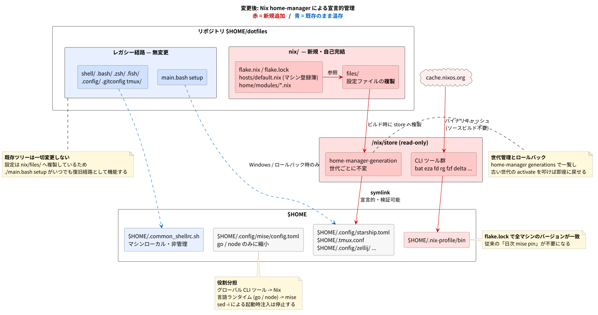

# ADR: dotfiles 管理を Nix home-manager へ移行する

| 項目 | 内容 |
| --- | --- |
| ステータス | 提案中 (Proposed) — draft PR [#18](https://github.com/pollenjp/dotfiles/pull/18) |
| 日付 | 2026-08-08 (JST) |
| 決定者 | pollenjp |
| 関連 | PR #18 / ブランチ `claude/home-manager-dotfile-management-id65ra` |
| 補足資料 | [textbook/](./textbook/README.md)（新規参画者向けの解説） |

---

## 1. 背景 (Context)

これまでの dotfiles は独自スクリプト `./main.bash setup` によって配置していた。加えて、実行時のパッケージ管理は **シェル起動のたびに** `mise` の設定ファイルを書き換える方式だった。

### 現状（変更前）の構造


### 課題

1. **配置が手続き的で検証できない**
   `main.bash:66-103` の `file_pairs` 配列を `ln -s` するだけで、「今何がどこに配置されているか」「適用前に何が変わるか」を確認する手段がない。さらに `Makefile` の `clean` は 13 個ある配置先のうち 4 個しか `unlink` しないため、**確実なアンインストール経路が存在しない**。

2. **パッケージ管理がシェル起動毎の破壊的変更**
   `shell/060_mise.sh` は起動のたびに `~/.config/mise/config.toml` を `sed -i` で書き換え、16 個のパッケージを `[tools]` に注入する。複数シェルの同時起動に備えて `flock` による排他まで自前で実装している。
   さらに `shell/252_alias_mise.sh` は日次で `mise use -g --pin` を走らせてバージョンを固定する。これは **`flake.lock` が本来担う役割を手で再実装したもの**にほかならない。

3. **起動時のネットワーク依存**
   `.fish/010_fish_fisher.fish` は fisher を `curl` で取得し、日次で `fisher update` を走らせる。再現性と起動レイテンシの両面で問題がある。
   （`.zsh/150-zi.zsh` は zsh 起動の**たびに** `source <(curl -sL https://git.io/zi-loader)` を実行するという、より重い同種の問題を抱えている。ただし後述のとおり zsh は今回の対象外。）

4. **暗黙の依存**
   `.gitconfig:31` は `pager = delta` を指定しているが、`git-delta` はどの管理下にもなく手動インストール前提だった。また `cargo:` 系の 5 パッケージ（`bat` / `eza` / `fd-find` / `procs` / `ripgrep`）は `cargo-binstall` 経由で **ソースビルド**されていた。

5. **OS 差分の手作業**
   `.gitconfig:11-17` の 1Password `op-ssh-sign` のパスは、WSL / Windows でコメントを手で切り替える運用になっている。コミット事故の温床。

---

## 2. 決定 (Decision)

dotfiles の管理を [Nix home-manager](https://nix-community.github.io/home-manager/) へ段階的に移行する。あわせて次を採用する。

1. **`nix/` 専用ディレクトリに閉じ、設定ファイルは複製する**
   既存ツリー（`shell/`, `.bash/`, `.zsh/`, `.fish/`, `.config/`, `main.bash`）は**一切変更しない**。設定は `nix/files/` へコピーする。移行期間中は同じ設定が 2 箇所に存在するが、既存マシンを壊さず並行検証するための意図的な代償。

2. **`flake.nix` はリポジトリ直下ではなく `nix/` に置く**
   複製方式のおかげで `nix/` が自己完結するため、flake の `self` が `nix/` に閉じ、store コピーがレガシーツリーを含まない。

3. **Nix store 管理**（`mkOutOfStoreSymlink` は使わない）
   編集の度に `home-manager switch` が必要になる代わりに、世代管理とロールバックが完全に効く。ただし**実行時にツール自身が書き込むファイルは例外**とする（§3 参照）。

4. **対象は Linux / macOS (aarch64) / WSL のみ**
   Windows (MINGW/MSYS) は Nix が動かないため対象外。`main.bash setup` を Windows 用および復旧用に残す。この割り切りにより `programs.*` モジュールを idiomatic に使える。

5. **対象シェルは bash / fish のみ。zsh は持ち込まない**

6. **グローバル CLI ツールは Nix、言語ランタイムは mise**
   プロジェクト毎のバージョン切替が必要な `go` / `node` は mise に残す。

7. **段階移行。どの段階でも `./main.bash setup` で戻せる状態を保つ**

### 変更後の構造（赤い部分が新規／変更点）



### 移行の順序


---

## 3. 変更点の詳細 (What changed)

| 変更前の仕組み | 変更後 (home-manager) |
| --- | --- |
| `main.bash setup`（symlink + rc 追記） | `home-manager switch --flake ~/dotfiles/nix#<host>` |
| 配置状態が不透明 | `nix build .#...activationPackage` で**適用前に配置ツリーを読める** |
| `Makefile clean` が 4/13 しか外さない | `home-manager uninstall` で全撤去。世代ロールバックも可能 |
| `shell/060_mise.sh` の `sed -i` 注入 | `home.packages` による宣言。マーカーファイルで旧注入を停止 |
| `shell/252_alias_mise.sh` の日次 pin | `flake.lock` |
| `cargo-binstall` によるソースビルド | nixpkgs のバイナリキャッシュ |
| `git-delta` が未管理 | `home.packages` に含める |
| `.gitconfig` の 1Password パス手動コメント切替 | `lib.mkIf config.dotfiles.isWSL` による自動分岐 |
| bash-completion を `curl` + `tar` | `programs.bash.enableCompletion` |
| fisher（curl インストーラ + 日次 update） | `programs.fish.plugins` + `fishPlugins.*` |

### store 管理の例外

「Nix store 管理」を原則とするが、**実行時にツール自身が書き込むファイルは store に置けない**（store は read-only）。調査で判明した該当パスと対処:

| パス | 書き込む主体 | 対処 |
| --- | --- | --- |
| `~/.config/mise/config.toml` | `sed -i` / 日次 `mise use --pin` | Nix 管理下に置かず mise に所有させる |
| `~/.config/git/config` | `git config --global` | `programs.git.includes` で `config.local` に書込先を逃がす |
| `~/.config/fish/fish_plugins` | `fisher` | Stage 5 で fisher ごと不要にする |
| `~/.ssh/config` | `main.bash` の Include 追記 | 今回は対象外（`.ssh` は未初期化の private submodule であり、flake は `?submodules=1` なしに submodule を取得しない） |
| `~/.common_shellrc.sh` | ユーザー（untracked） | **絶対に Nix 管理下に置かない**。半端な移行状態での復旧経路 |

### 対象外にしたもの

| 対象 | 理由 |
| --- | --- |
| zsh (`.zshrc`, `.zsh/`, `p10k/`) | nix 側に持ち込まない。レガシー経路では従来どおり動作する |
| `.config/pypoetry/` | 古いため |
| `_zshrc_mac`, `_screenrc_for_mac`, `_vimrc_for_windows` | 参照されていない死んだファイル |
| `programs.tmux` | 独自の prefix/escape-time 設定を前置する。tpm 未使用のため利点なし → 素のファイル配置 |
| `programs.neovim` | `init.lua` を書き出し `~/.config/nvim` のディレクトリ配置と衝突する → 素のファイル配置 |
| `programs.zellij` | KDL 生成の書き換えコストが高く、`enable*Integration` は**シェル起動毎に zellij を自動起動する**罠がある → 素のファイル配置 |
| `nix-darwin` | `/etc`・launchd・Homebrew を管理するもので本リポジトリの用途にない |

---

## 4. 検討した代替案 (Alternatives considered)

| 案 | 概要 | 不採用の理由 |
| --- | --- | --- |
| 現状維持 (`main.bash` 継続) | 独自スクリプトを改善して使い続ける | 手続き的・差分確認不可・アンインストール経路なしという根本課題が残る |
| **chezmoi** ([PR #17](https://github.com/pollenjp/dotfiles/pull/17)) | テンプレートと `chezmoi apply` による宣言的配置。ADR 実装済みの未マージブランチが存在する | dotfile の配置は解決するが**パッケージ管理は範囲外**で、mise の `sed -i` 問題と自作 lockfile 問題が残る。Nix なら配置とパッケージを単一の `flake.lock` で固定でき、世代ロールバックも得られる |
| GNU Stow | symlink farm 管理 | テンプレート / OS 分岐 / パッケージ管理の仕組みがなく、結局スクリプトが必要 |
| dotbot / yadm | 宣言的 install / git ラッパ | パッケージのバージョン固定ができない |
| `mkOutOfStoreSymlink` 方式 | `~/.config/... -> ~/dotfiles/...` の symlink を張り、直接編集の即時反映を維持する | 現状の UX を保てる利点はあるが、世代ロールバックがファイル内容に効かない。再現性を優先して store 管理を選択した |
| `flake.nix` をリポジトリ直下に置く | `home-manager switch --flake ~/dotfiles#...` と書けて短い | store コピーにレガシーツリー全体が入る。複製方式なら `nix/` に閉じられるので採らなかった |
| Nix で全部管理（mise 廃止） | 言語ランタイムも Nix + direnv で管理 | プロジェクト毎のランタイム切替を全リポジトリに flake を置いて実現するのは負担が大きい。将来の別 ADR とする |

---

## 5. 影響 (Consequences)

### 良くなること

- **適用前に差分を確認できる。** `nix build .#homeConfigurations."<host>".activationPackage` の結果を `find` すれば、配置される全ファイルを事前に読める。
- **世代管理とロールバック。** `home-manager generations` で一覧し、古い世代の `activate` を叩けば即座に戻せる。
- **`flake.lock` により全マシンのツールバージョンが一致する。** 日次 pin の自作ロジックが不要になる。
- **ソースビルドが消える。** `cargo:` 系 5 パッケージがバイナリキャッシュから入る。
- **OS 差分が自動化される。** 1Password のパス手動コメント切替が不要になり、コミット事故の温床が消える。
- **起動時のネットワークアクセスが減る。** fisher の curl と日次 update、bash-completion の curl が消える。

### 注意が必要なこと（レビュー対象）

- ⚠️ **編集ワークフローが変わる。** store 管理のため、設定を変えたら `home-manager switch` が必要になる。symlink 直接編集の即時反映は失われる。
- ⚠️ **`mise activate` は shim を PATH の先頭に差す。** `.zsh/103_mise.zsh` は `shell/0xx_*` の**後**にロードされるため、mise のリストに残っている限り mise 側が Nix 側を上書きする。**Stage 4 のリスト削減は美観ではなく必須。**
- ⚠️ **既に `~/.config/mise/config.toml` に書き込まれた 16 エントリは自動では消えない。** マシン毎に一度だけ手で言語ランタイムのみへ削る必要がある。
- ⚠️ **Stage 5 で `programs.bash` が `~/.bashrc` を所有する。** 事前に `append_load_rc_line` (`script/utils.bash:25-49`) が追記したガード付き stanza と、bash-completion のローダ行 (`main.bash:213-219`) を削除しないと `Existing file ... would be clobbered` で失敗する。
- ⚠️ **`-b bak` は `<file>.bak` が既に存在すると失敗する。** 部分失敗からのリトライ時は古い `.bak` を先に消すこと。
- ⚠️ **x86_64-darwin (Intel Mac) は対象外。** nixpkgs 26.11 でサポートが打ち切られ、評価時点で `Nixpkgs 26.11 has dropped support for x86_64-darwin.` で落ちる。
- **移行期間中は設定が 2 箇所に存在する。** 意図的な選択だが、片方だけ直す事故に注意。Stage 6 で収束を判断する。

---

## 6. 検証 (Verification)

nixpkgs 26.11pre (`70ce2343`) / home-manager master (`7834e825`) に対して、Stage 1 の内容を検証した。

- `nix flake check --all-systems --no-build` が 3 system 全てで通過（`all checks passed!`）
- `nix build .#homeConfigurations.sandbox.activationPackage` が成功
- 使い捨て `$HOME` (`/tmp/hm-sandbox`) への `activate` が成功
- 再実行しても世代が増えないこと（冪等）を確認
- 導入対象 18 個のバイナリがすべて profile に存在することを確認
- `nixfmt --check` が全 `.nix` ファイルで通過

検証で判明し、その場で修正した点:

- `x86_64-darwin` は nixpkgs 26.11 で評価が落ちるため対象 system から除外した
- `nixfmt-rfc-style` は非推奨（`now the same as pkgs.nixfmt`）だったため `nixfmt` に変更した
- `home.stateVersion` の有効値は `26.11` が最大。greenfield なので最新に合わせた

> **検証環境の制約**: 作業環境は `codeload.github.com` がネットワークポリシーで遮断されており、`github:` 形式 input のソース取得ができない。検証は input を git プロトコル / channels tarball に差し替えて実施した（同一リビジョン）。`flake.lock` の narHash 照合のみ未実施。

---

## 7. 移行・運用手順

```sh
# 1. Nix を導入
curl -fsSL https://install.determinate.systems/nix | sh -s -- install

# 2. 何が配置されるかを $HOME に触れず確認する
#    (home-files は store への symlink なので find に -L が必須)
cd ~/dotfiles/nix
nix build '.#homeConfigurations."pollenjp@wsl".activationPackage' -o /tmp/hm
find -L /tmp/hm/home-files -mindepth 1 -maxdepth 3

# 3. main.bash が張った symlink を外す (Stage 3 以降)
./scripts/preflight-unlink.sh

# 4. 初回適用
#    この時点では home-manager コマンドはまだ存在しない。
#    programs.home-manager.enable が CLI を profile へ入れるのは
#    初回の activate が成功した後なので、1 回目は flake から直接実行する。
nix run ~/dotfiles/nix#home-manager -- switch --flake ~/dotfiles/nix#pollenjp@wsl -b bak --dry-run
nix run ~/dotfiles/nix#home-manager -- switch --flake ~/dotfiles/nix#pollenjp@wsl -b bak

# 日常 (初回以降は profile に入るので短く書ける)
home-manager switch --flake ~/dotfiles/nix#pollenjp@wsl
home-manager generations
nix flake update --flake ~/dotfiles/nix
```

> `nix run home-manager -- ...`（レジストリ経由）は使わないこと。nixpkgs 同梱の別バージョンが
> 実行され、`flake.lock` で固定した home-manager モジュールとバージョンがずれる。
> flake が `packages.<system>.home-manager` を公開しているのはこのため。

**ロールバック**は 3 段階:

1. `home-manager generations` で古い世代の `activate` を実行する
2. `home-manager uninstall` で全撤去する
3. **最終手段として `./main.bash setup` が動く** — Stage 6 まで `main.bash` を触らないのはこのため

---

## 8. 参考 (References)

- home-manager 公式: <https://nix-community.github.io/home-manager/>
- home-manager オプション一覧: <https://nix-community.github.io/home-manager/options.xhtml>
- Nix flakes: <https://nix.dev/concepts/flakes.html>
- 本 ADR の入門ドキュメント: [textbook/README.md](./textbook/README.md)
- 図の再生成: [`plantuml/`](./plantuml/) で `mise run plantuml:generate`（`plantuml/mise.toml` 参照）
- 代替案として検討した chezmoi 移行 ADR: `docs/adr/2026-07/19T093812JST_chezmoi_migration/`（ブランチ `claude/dotfiles-chezmoi-migration-95xj5i`）
