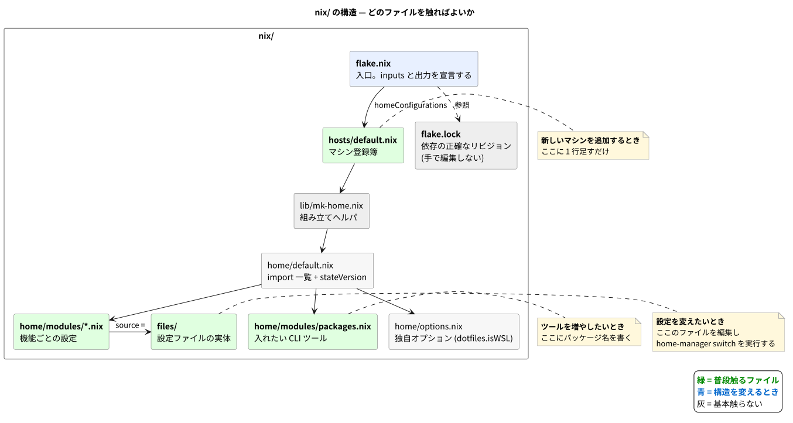

# 03. このリポジトリの `nix/` を読む

前章までが一般論。ここからはこのリポジトリ固有の話。

## 全体像



```
nix/
├── flake.nix              入口
├── flake.lock             依存の正確なリビジョン (手で編集しない)
├── lib/mk-home.nix        組み立てヘルパ
├── hosts/default.nix      マシン登録簿          <- よく触る
├── home/
│   ├── default.nix        import 一覧 + stateVersion
│   ├── options.nix        独自オプション
│   └── modules/
│       ├── packages.nix   入れたい CLI ツール    <- よく触る
│       └── *.nix          機能ごとの設定        <- よく触る
├── files/                 設定ファイルの実体     <- よく触る
├── scripts/
│   ├── verify.sh          検証を一括実行
│   └── preflight-unlink.sh  main.bash の symlink を外す
└── README.md
```

## なぜ `nix/` の下に閉じているのか

普通、`flake.nix` はリポジトリ直下に置く。このリポジトリはあえて `nix/` の下に置いている。

理由は **設定ファイルを複製する方針**を採ったから。`nix/files/` に実体があるので、`nix/` の外を参照する必要がない。結果として:

- flake の store コピーがレガシーツリー (`shell/`, `.zsh/`, ...) を含まない
- 既存の仕組みと構造的に切り離される

<details><summary>flake の self と、なぜ場所が制約になるのか</summary>

flake の中で `self` と書くと、**`flake.nix` があるディレクトリ**を指す。

もし `nix/flake.nix` から `../.config/starship.toml` を参照しようとすると、それは `self` の外なので**参照できない**。

逆に言えば、外を参照しないなら `nix/` に置いてよい。今回は複製方式なのでこれが成立している。もし「既存ファイルを直接参照する」方針だったら、`flake.nix` はリポジトリ直下に置く必要があった。

</details>

## 適用してみる

```sh
home-manager switch --flake ~/dotfiles/nix#pollenjp@wsl
```

`#` の後ろは `hosts/default.nix` に登録した名前。

> ⚠️ **まだ一度も適用していないマシンでは `home-manager: command not found` になる。**
> CLI が profile に入るのは初回の activate が成功した後なので、1 回目だけは
> `nix run ~/dotfiles/nix#home-manager -- switch --flake ~/dotfiles/nix#pollenjp@wsl` と書く。
> 詳しくは [04_migration.md](./04_migration.md)。

## よく触る 3 箇所

### 1. マシンを増やす → `hosts/default.nix`

```nix
"pollenjp@wsl" = mkHome {
  username = "pollenjp";
  system = "x86_64-linux";
  isWSL = true;
};
```

1 マシン 1 行。これだけ。

<details><summary>なぜ username を直接書くのか</summary>

home-manager は activate 時に、`$USER` と `home.username` が食い違うと中断する。

「環境変数から取ればいいのでは」と思うが、`builtins.getEnv "USER"` は `--impure` フラグが必要になり、**`nix flake check` が動かなくなる**。

<details><summary>純粋評価 (pure evaluation) とは</summary>

Nix は「同じ入力なら同じ出力」を守るため、既定では**環境変数・現在時刻・ネットワークなど、外部の状態を読めない**。これを純粋評価と呼ぶ。

`getEnv` はこの原則を破るので `--impure` が要る。`nix flake check` は純粋評価を前提にしているため、`--impure` が必要な flake は検証できなくなる。だから明示的に書く方を選んでいる。

</details>

</details>

### 2. ツールを増やす → `home/modules/packages.nix`

```nix
home.packages = with pkgs; [
  bat eza fd procs ripgrep
  fzf ghq jq starship watchexec zellij fish
  delta tmux vim neovim mise
];
```

パッケージ名は <https://search.nixos.org/packages> で調べる。

> ⚠️ **`mise` に同じツールが残っていると mise 側が勝つ。**
> `mise activate` は shim を PATH の**先頭**に差し、`.zsh/103_mise.zsh` は `shell/0xx_*` の**後**に読み込まれるため。
> Nix に移したツールは mise のリストから消さないと効かない。

<details><summary>shim (シム) とは</summary>

本体の代わりに置かれる小さな中継プログラム。`~/.local/share/mise/shims/node` を実行すると、mise がプロジェクト設定を見て「このディレクトリでは node 22」と判断し、本物へ橋渡しする。

これがプロジェクト毎のバージョン切替を実現している仕組みであり、同時に **PATH の先頭を占める**理由でもある。

</details>

### 3. 設定を変える → `files/` または `home/modules/*.nix`

素のファイルとして置いているもの (starship / zellij / nvim / tmux) は `files/` を直接編集する。

`programs.*` で生成しているもの (git など) は該当モジュールを編集する。

どちらの場合も、編集後に `home-manager switch` が必要。

## flake.nix の中で押さえておく点

### `checks` が要る理由

```nix
checks = forAllSystems (system:
  lib.mapAttrs' (name: cfg: lib.nameValuePair "home-${name}" cfg.activationPackage)
    (lib.filterAttrs (_: cfg: cfg.pkgs.stdenv.hostPlatform.system == system)
      self.homeConfigurations));
```

**`nix flake check` は `homeConfigurations` を検証しない。** flake の「よく知られた出力」ではないため。

そこで `activationPackage` を `checks` に再エクスポートしている。これで初めて `nix flake check` が設定の壊れを検出できる。

### `follows` で揃える

```nix
home-manager = {
  url = "github:nix-community/home-manager";
  inputs.nixpkgs.follows = "nixpkgs";
};
```

home-manager も内部で nixpkgs を参照している。`follows` を書かないと **nixpkgs が 2 つ**存在することになり、バージョン不一致による不可解な壊れ方をする。home-manager でいちばん多い事故。

### `stateVersion` は動かさない

```nix
home.stateVersion = "26.11";  # DO NOT CHANGE
```

<details><summary>stateVersion とは</summary>

「この設定はどのリリースの流儀で書かれているか」を示す印。

home-manager は後方互換のため、古い stateVersion では古い挙動を維持する。**上げると挙動が変わる**ので、リリースノートを読まずに上げてはいけない。新規導入時に最新を設定し、以後は固定する。

有効値の一覧はこう調べられる。

```sh
nix eval .#homeConfigurations.sandbox.options.home.stateVersion.type.description
```

</details>

## 検証用の `sandbox`

`hosts/default.nix` には実マシン以外に `sandbox` が登録してある。

```nix
sandbox = mkHome {
  username = "user";
  system = "x86_64-linux";
  homeDirectory = "/tmp/hm-sandbox";
};
```

`homeDirectory` を `/tmp` に固定してあるので、**本物の `$HOME` を汚さずに activate を試せる**。

```sh
mkdir -p /tmp/hm-sandbox/.local/state/nix/profiles
HOME=/tmp/hm-sandbox nix run .#home-manager -- switch --flake .#sandbox -b bak
```

設定を大きく変えたときは、実マシンに適用する前にここで試すとよい。

---

前: [02_home_manager.md](./02_home_manager.md) / 次: [04_migration.md](./04_migration.md)
