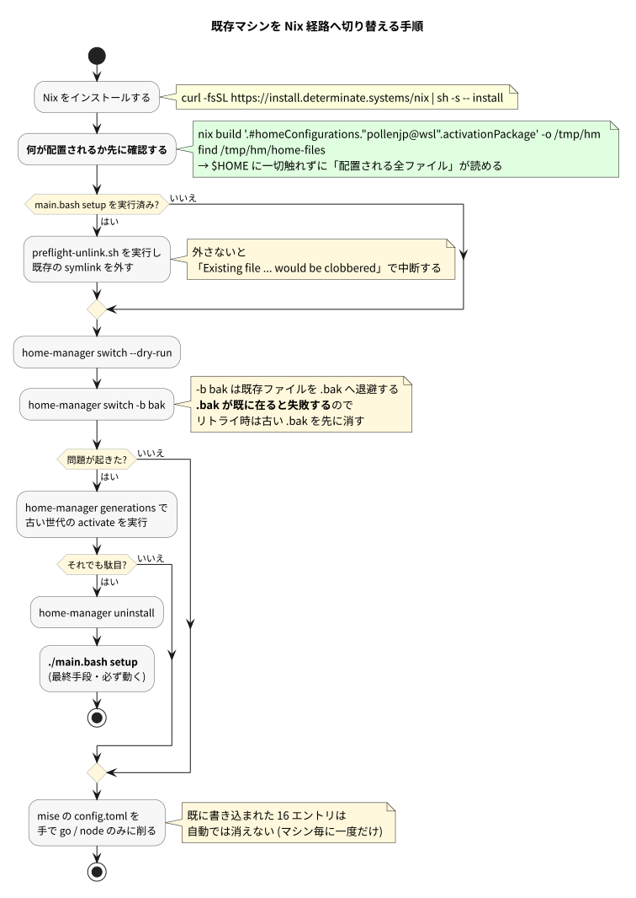

# 04. 既存マシンを切り替える

ここは実際に手を動かす章。**焦らず、順番どおりに。**



## 大原則

> **同じマシンで `main.bash setup` と home-manager の両方を走らせない。**

どちらも同じパスを管理しようとするため。マシン単位でどちらか一方を選ぶ。

そして、**いつでも `./main.bash setup` に戻れる**。これが移行を安全にしている土台なので、Stage 6 まで `main.bash` には手を触れない。

## 手順

### 1. Nix を入れる

```sh
curl -fsSL https://install.determinate.systems/nix | sh -s -- install
```

<details><summary>公式インストーラとの違い</summary>

Determinate Systems 版は flakes が最初から有効で、アンインストーラも付属する。公式版を使う場合は experimental features を自分で有効にする必要がある。

```sh
sh <(curl -L https://nixos.org/nix/install) --daemon
mkdir -p ~/.config/nix
printf 'experimental-features = nix-command flakes\n' >> ~/.config/nix/nix.conf
```

systemd のないコンテナでは `--daemon` が失敗するので `--no-daemon` を使う。root で single-user install する場合は `/etc/nix/nix.conf` に `build-users-group =` (空) の指定も要る。

</details>

### 2. 何が配置されるか先に見る

**ここが最も重要。** `$HOME` に一切触れずに、配置される全ファイルを確認できる。

```sh
cd ~/dotfiles/nix
nix build '.#homeConfigurations."pollenjp@wsl".activationPackage' -o /tmp/hm
find /tmp/hm/home-files -mindepth 1 -maxdepth 3
```

ここに出たパスが、これから home-manager が管理するもの。**次のステップで外すべき symlink の一覧そのもの**でもある。

### 3. 既存の symlink を外す

`main.bash setup` を実行済みのマシンでは、先に外す。

```sh
./nix/scripts/preflight-unlink.sh
```

外さないとこうなる。

```
Existing file '/home/user/.tmux.conf' would be clobbered by home-manager
```

<details><summary>なぜ home-manager が作った symlink でなくても駄目なのか</summary>

home-manager は「自分が作ったもの以外は勝手に消さない」設計になっている。これは安全策であって不便ではない。

`main.bash` が作った symlink も「自分が作ったものではない」ので、この検査に引っかかる。

</details>

### 4. dry-run してから適用する

```sh
home-manager switch --flake ~/dotfiles/nix#pollenjp@wsl -b bak --dry-run
home-manager switch --flake ~/dotfiles/nix#pollenjp@wsl -b bak
```

`-b bak` は既存ファイルを `<名前>.bak` に退避してから進める。

> ⚠️ **`.bak` が既に存在すると失敗する。** 途中で失敗して再挑戦するときは、古い `.bak` を先に消すこと。

### 5. 確認する

```sh
readlink ~/.config/starship.toml   # /nix/store/... を指していれば成功
home-manager generations
```

### 6. mise の設定を削る

**ここを忘れやすい。** 前のステップまでで「これから注入されること」は止まるが、**既に `~/.config/mise/config.toml` に書き込まれた 16 エントリは残ったまま**。

```sh
$EDITOR ~/.config/mise/config.toml
```

`go` / `node` / `usage` だけ残し、Nix に移したツール (`bat` `eza` `fd-find` `procs` `ripgrep` `fzf` `ghq` `jq` `starship` `watchexec` `zellij` `fish` `cargo-binstall`) を消す。

消さないと **mise の shim が PATH の先頭にいるため、Nix で入れたツールが使われない**。

## 困ったときの戻し方

軽い順に 3 段階。

### ① 前の世代に戻す

```sh
home-manager generations
# 2026-08-08 07:18 : id 1 -> /nix/store/wj3f4...-home-manager-generation
/nix/store/wj3f4...-home-manager-generation/activate
```

### ② home-manager を丸ごと外す

```sh
home-manager uninstall
```

home-manager が管理していた symlink がすべて外れる。

### ③ 元の仕組みに戻す

```sh
cd ~/dotfiles && ./main.bash setup
```

**これは必ず動く。** Stage 6 まで `main.bash` を触らないのはこのため。

## シェルが壊れたときの保険

Stage 5 で `programs.bash` が `~/.bashrc` を所有するようになると、失敗したときにシェルが起動しなくなる可能性がある。

保険は 2 つ。

1. **`-b bak` で退避された `~/.bashrc.bak` を戻す**

   ```sh
   sh -c 'cp ~/.bashrc.bak ~/.bashrc'
   ```

2. **`~/.common_shellrc.sh` は絶対に home-manager 管理下に置かない**

   このファイルはマシンローカルの逃げ道として意図的に管理外にしてある。緊急時にここへ直接 PATH を書けば作業を継続できる。

## Stage 5 の事前作業

`programs.bash` を有効にする前に、`~/.bashrc` から次の 2 つを手で消しておく。

1. `main.bash` が追記したガード付き stanza（`this_file=` と `realpath` を含むブロック）
2. bash-completion のローダ行（`main.bash:213-219` が追記したもの）

消さないと `Existing file ... would be clobbered` で止まる。

---

前: [03_this_repo.md](./03_this_repo.md) / 次: [05_daily_usage.md](./05_daily_usage.md)
